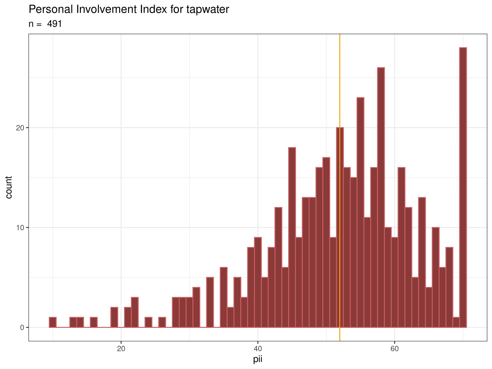
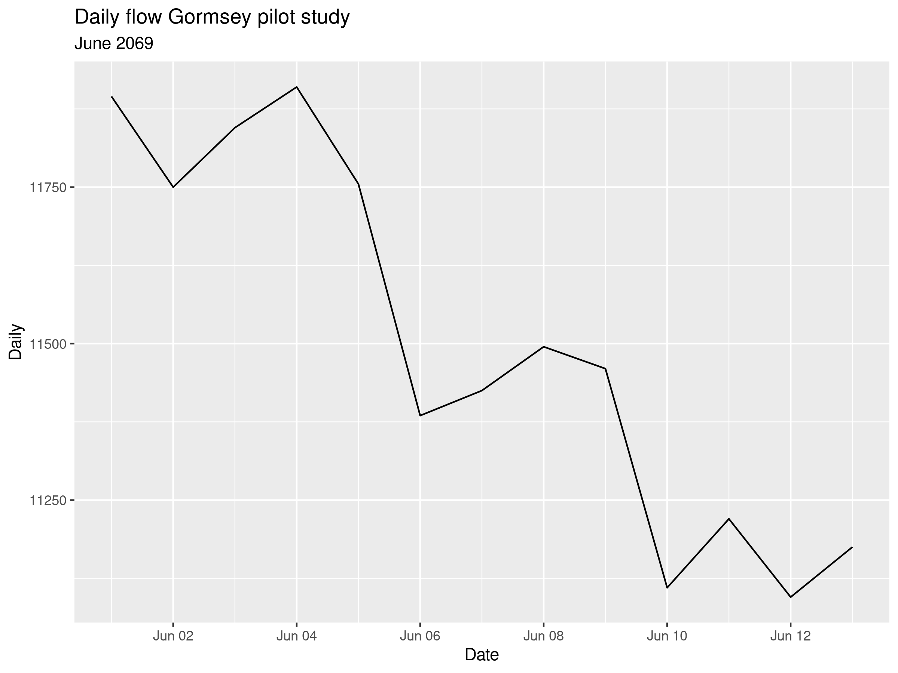

## Analysing data with the Tidyverse
Before we get started with analysing water consumption, we return to case study 2 to explain some principles of analysing data with the *dplyr* library of the Tidyverse. We still have not answered the main question for this case study: What is the level of consumer involvement for tap water?

X> Activate the Tidyverse library and read the Personal Involvement Index data (you created this in [Case Study 2](#involvement)) to the `involvement` data frame.

In case you forgot, this data frame consists of four variables: the respondent id, their city of origin, the item on the scale and the score. The `glimpse()` function gives this result:

{line-numbers: false}
```
Observations: 4,910
Variables: 4
$ id    <chr> "R_eqvaSnwkUPEwKz3", "R_50zNvLsNRxFctxj", "R_3env6Rl1UGW2m4R"…
$ City  <chr> "Los Angeles", "Boston", "Denver", "Boston", "Denver", "Denve…
$ Item  <chr> "p01", "p01", "p01", "p01", "p01", "p01", "p01", "p01", "p01"…
$ Score <dbl> 7, 7, 6, 7, 7, 7, 7, 7, 5, 7, 7, 7, 7, 2, 6, 6, 7, 1, 6, 7, 7…
```

The Personal Involvement Index is the sum of all the scores within the scale. Technically we need to confirm this through factor analysis, but that is outside the scope of this course. You can read about the detailed analysis of this data in [The Invisible Water Utility](http://hdl.handle.net/1959.9/561679).

The first step to answer the case study question is to add all the scores for each respondent. The score variable contains several `NA` values, which means that customers did not answer 520 items. Use `table(pii$Score, useNA = "always")` to verify this claim.

When we add a vector of numbers with an `NA` value, the result is also `NA`, unless you specifically tell R otherwise with the `na.rm = TRUE` option. We need this option because we can only use completed surveys.

{format: r, line-numbers: false}
```
a <- c(1, 3, NA, 5, 6)
sum(a)
sum(a, na.rm = TRUE)
```

To calculate the level of involvement with tap water for each respondent, we need to group the data by respondent id and add all the scores. We should not remove the NA values because that leads to invalid scores. We can only calculate the level of involvement if we have an answer to all questions. Those respondents that did not answer all items have `NA` as their involvement score.

An alternative option would be to remove all respondents that did not answer all questions in the data cleaning phase.

The *dplyr* library in the Tidyverse has very strong capabilities to slide-and-dice data. When analysing large sets of data, such as smart meters, you are only ever interested in groups or sections of the data. 

The `group_by()` function helps with this task. This function takes an existing data frame and converts it to a grouped table. The next step is to calculate the involvement of each customer. The `summarise()` function, as the name suggests, summarises the data in (groups of) data frames.

These two functions are the working horse of the Tidyverse, and we use them extensively to analyse the smart meter data.

{format: r, line-numbers: false}
```
libary(tidyverse)

pii <- read_csv("casestudy2/involvement_tidy.csv")

involvement <- pii %>%
    group_by(id) %>%
    summarise(pii = sum(Score))

ggplot(involvement, aes(pii)) + 
    geom_histogram(fill = "indianred4", col = "white", binwidth = 1) + 
    geom_vline(xintercept = mean(involvement$pii, na.rm = TRUE), col = "orange") + 
    labs(title = "Personal Involvement Index for tapwater",
         subtitle = paste("n = ", nrow(involvement))) + 
	theme_bw()
```



X> Reverse engineer the code to understand how it works.

Q> How many `NA` values are there in the involvement data frame? 

D> Review the results of the Personal Involvement Index. What story does this histogram tell you?


## Analysing Time Series

## Answers
The following section contains the answer to the questions in this chapter.

### How many NA values are there in the involvement data frame?
We can answer this questions in two ways. The basic way is by using the `table()` function we have seen before, but setting the `useNA` option to "always".
 
The second method uses the Tidyverse method by first filtering all `NA` values and piping the result to the `count()` function.

{format: r, line-numbers: false}
```
table(involvement$pii, useNA = "always")

filter(involvement, is.na(pii)) %>%
    count()
```

### Recreate the graph in figure 7.3
The first two lines filter the data for the requested device and slice the first 48 rows, as suggested. 

The result of this filter is piped to the ggplot function with a line geometry. The `scale_y_continuous()` function has many options to define how to display the axis. In this case we instruct ggplot to scale the y-axis from 0 to 100 litres per hour. Lastly, we add some titles to the plot to provide context and ensure the saved file is always identifiable.

{format: r, line-numbers: false}
```
filter(flow, DeviceID == "RTU-210156") %>%
    slice(1:48) %>%
    ggplot(aes(TimeStamp, Flow)) + 
    geom_line() + 
    scale_y_continuous(limits = c(0, 100)) + 
    labs(title = "Flow profile",
         subtitle = "RTU-210156")
```

This plot shows the first two days for this random service. You see a typical diurnal curve, but night time use is higher than morning use. This could imply watering the garden after work. Most interesting is that the minimum flow is just below fifty litres per hour. We would expect that there are at least some periods with zero flow. This data is thus indicative of a leak.

### Replicate figure 7.4
The code below uses the `slice()` function to pick the top ten. The ggplot package automatically shows the services in alpha-numerical order. When we want to show a top x of a data set it is better to sort the bars by size so that we immediately see the relative differences.

We can force the order of the bars by changing the level of the factor variable. The *ggplot* package converts the `DeviceID` to a factor to visualise the data in categories. 

By default, R sets the levels of a factor in alpha-numerical order. Run `factor(top10$DeviceID)` to see the levels. We can use the `levels` option to force the order to something else. 

The `order()` function gives the order of a vector. The result is a new vector with index numbers. Execute `order(top10$Consumption)` to see the result.

Reverse engineer the code below to see how to change the levels of a factor.

{format: r, line-numbers: false}
```
top10 <- flow %>%
    group_by(DeviceID) %>%
    summarise(Consumption = sum(Flow) / 1000) %>%
    arrange(desc(Consumption)) %>%
    slice(1:10)

top10$DeviceID <- factor(top10$DeviceID, levels = top10$DeviceID[order(top10$Consumption)])

ggplot(top10, aes(DeviceID, Consumption)) + 
    geom_col(fill = "dodgerblue4") + 
    coord_flip() + 
    labs(title = "Top-10 consumption")
```

### Days alive
As usual, there is more than one way to solve this problem. We first need to create a date variable for the birthday and one for the current day. To find the number of days you subtract these from each other. R also has a function to determine the current date, which makes this a bit shorter and generic because it can be repeated at any time.

{format: r, line-numbers: false}
```
birth <- as.Date("1977-03-03")
now <- as.Date("2019-07-17")

now - birth

Sys.Date() - birth
```

### Visualise daily consumption
To group the data by day, we first need to create a grouping variable with just the date and without the time. We could create a new variable with `mutate(Date = as.Date(TimeStamp)`, but the `group_by()` function can also create new variables, as show below.

{format: r, line-numbers: false}
```
filter(flow, TimeStamp >= as.Date("2069-06-01"), TimeStamp <= as.Date("2069-06-14")) %>%
    group_by(Date = as.Date(TimeStamp)) %>%
    summarise(Daily = sum(Flow)) %>%
    ggplot(aes(Date, Daily)) + 
    geom_line() + 
    labs(title = "Daily flow Gormsey pilot study",
         subtitle = "June 2069")
```



### Leak detection
This crude leak detection code looks for all properties where the minimum flow is more than zero litres per hour.

{format: r, line-numbers: false}
```
flow %>%
    group_by(DeviceID) %>%
    summarise(MinFlow = min(Flow)) %>%
    filter(MinFlow != 0)
```

This is the last session in this course. The [last chapter](#close) reflects on what you have learned and provides suggestions for further study.
