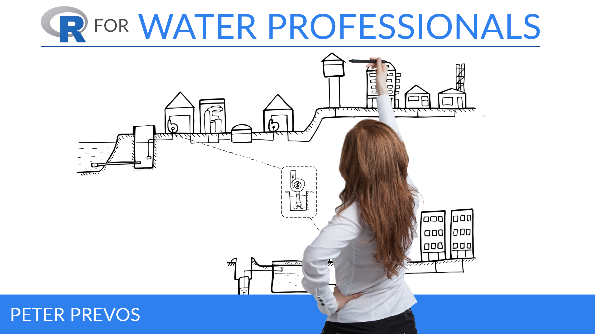
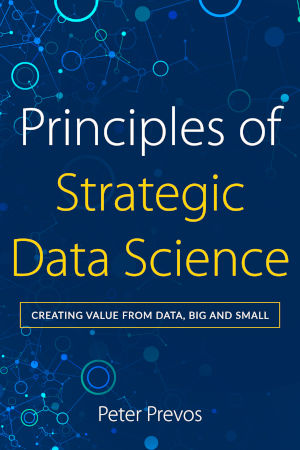
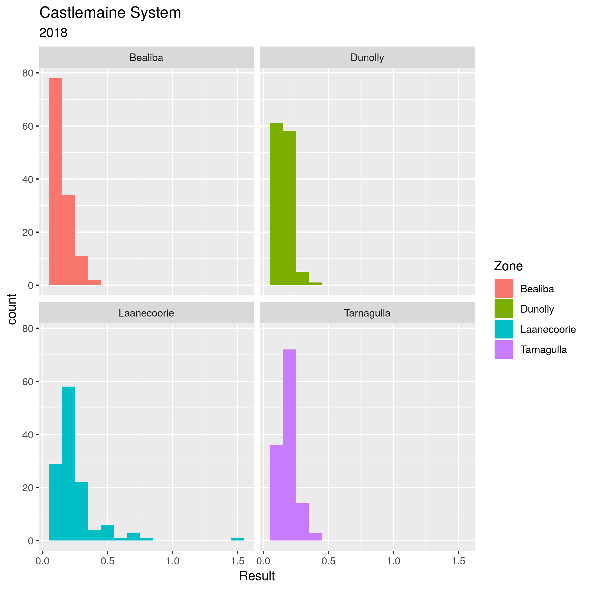
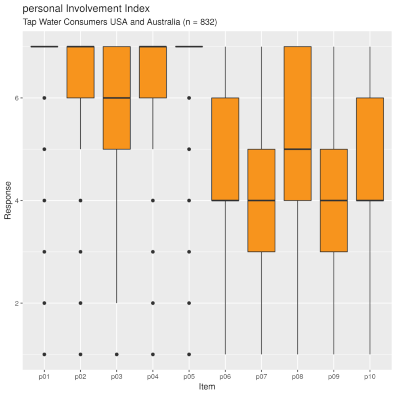
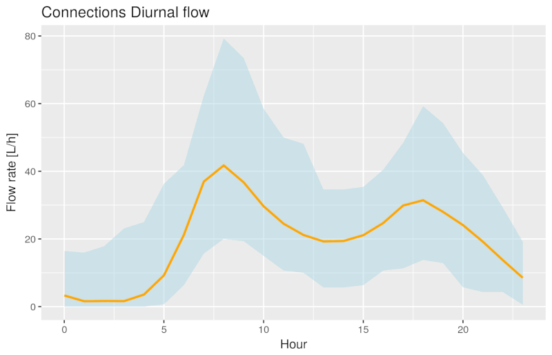

# R for Water Professionals

{fullbleed: true}

Managing reliable water services requires not only a sufficient volume of water but also significant amounts of data. Water professionals continuously measure the flow and quality of the water and asses how customers perceive their service. Water utilities are awash, or even flooded with data. Data professionals use data pipelines and data lakes and make data flow from one place to another.

Data and water are, as such, natural partners. Professionals in the water industry rarely directly interact with water or customers, but they are constantly analysing data that describes these realities. The purpose of collecting and analysing this data is to maintain or improve the level of service to customers and to minimise the impact on the natural environment.

Most professionals use spreadsheets to work with data. While these tools are handy, they are not ideal when working with large and complex sets of data. Specialists in data analysis prefer to write code in one of the many available computing languages. 

This course introduces water utility professionals to the [R language](https://en.wikipedia.org/wiki/R_(programming_language)) for statistical computing. This language is one of the most popular tools among data scientists to create value from data. 

This workshop is not an exhaustive introduction into data science programming but a teaser to inspire water professionals to [ditch their spreadsheets](https://lucidmanager.org/spreadsheets-for-data-science/) and start writing code to analyse data.

## Course content
The course consists of four sessions. The first session introduces the principles of data science within the context of managing a water utility. The next three sessions include realistic case studies about water management. The last three sessions start with a problem statement about the relevant case study. The second part introduces participants to relevant aspects of the R language. Participants have to load, transform, explore and analyse the data to solve the problem.

E> The content for this course is under development. The full content will be available in the second week of July 2019.

## Session 1: Introduction to Water Utility Data Science
The first session defines data science as an evolution of traditional analysis. The greater availability of data, enhanced computer capacity and tools to analyse this information have revolutionised the industry. The second part of this session introduces a framework for best practice in data science.

The content of this session is based on the ebook *Principles of Strategic Data Science*. Participants of this course can download a [free copy](http://leanpub.com/strategic_data_science/c/r4h2o) of this book.

{width: "25%", alt: "Principles of Strategic Data Science.", align: center}

## Session 2: Introduction to data science programming
This first session starts with an introduction to the principles and best practice in data science. This session also introduces the basics of the R language to undertake simple statistical analysis.

This session uses laboratory testing data from a drinking water network. Participants use this data to assess descriptive statistics and compliance with regulations.

{width: "70%", alt: "Distribution of turbidity results.", align: "middle"}

## Session 3: Processing Data
The Tidyverse is an extension of the R language that provides additional functionality that simplifies analysing data. In the second session, participants learn how to clean and explore data.

The case study for this data are the results of a survey among American consumers about their perception of water services. Participants use this data set to clean, transform and visualise the data.

{width: "70%", alt: "Consumer involvement with tap water.", align: "middle"}

## Session 4: Analysing data
In the last session, participants will analyse an extensive data set to find anomalies in the water consumption data.

The case study for this session is simulated smart meter data for a water system. This data also contains simulated leaks and other anomalies.

{width: "70%", alt: "Digital metering diurnal curve.", align: "middle"}

## Prerequisites
To follow participate in this workshop, you need to have some understanding of the issues surrounding water management and experience with analysing data. Experience with writing computer code is helpful, but not required. 

You will also need access to a recent version of the R language and RStudio. The best way to access the R language is by downloading the latest version from the website of the [R Project for Statistical Computing](https://www.r-project.org/). RStudio is an IDE (Integrated Development Environment) that simplifies working with R and data. You can download a free version of this software from the [RStudio](https://www.rstudio.com/) website. Follow the instructions on these websites to complete the installation. You will need to install the R language before you install the IDE.

Alternatively, you can sign-up for a free account to access the [cloud version](https://rstudio.cloud/) of R Studio. This account will give you full access to R Studio and R in your browser without the need to install any software. The cloud version is fully functional but not very fast. Installing R and RStudio on your laptop is the preferred method.

## Downloading the workshop material
All resources for this workshop are available on the [https://github.com/pprevos/r4h2o/](GitHub) website. GitHub is a popular repository for computer code and associated information that allows developers to share their work and collaborate.

You can download the documents by clicking on the 'clone or download' button and extract the files to your computer. You can open the RStudio project file to begin the workshop and start playing with the data and code.

For those using the cloud version of RStudio, click on the arrow next to the 'New Project' button and select 'New Project from GitHub Repo'. Copy the URL of this repository in the text field and hit enter. After a little while, RStudio will open the project.

If you understand how to use Git, then feel free to fork and clone the repository. Feel free to create an issue or pull request if you find errors or like to provide additional content.

X> Install R and RStudio and download the workshop materials.
