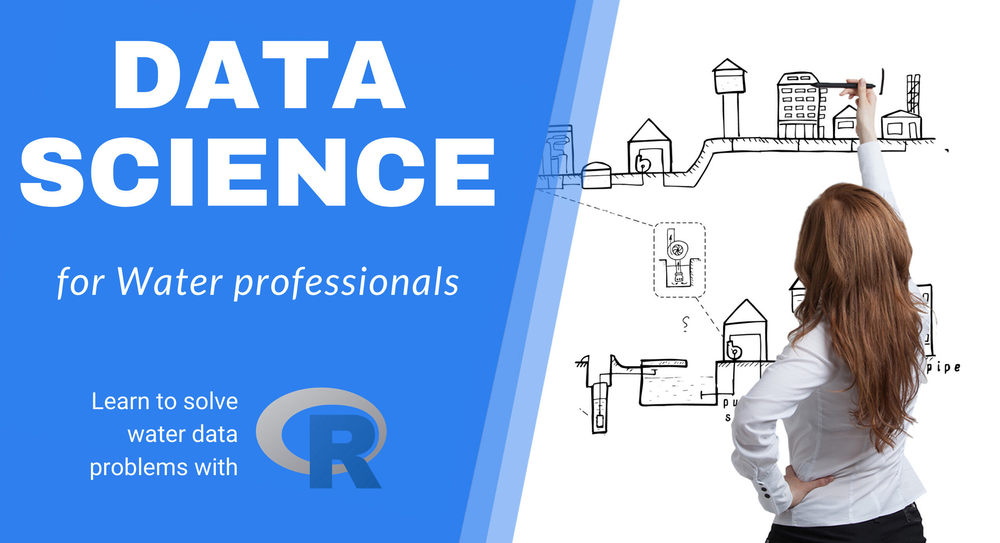
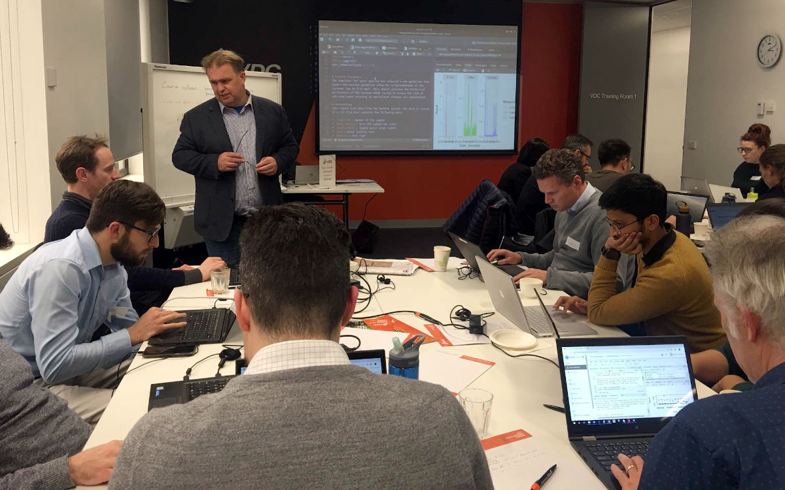

# Data Science for Water Professionals {#introduction}
{width: "100%"}

Managing reliable water services requires not only a sufficient volume of water but also significant amounts of data. Water professionals continuously measure the flow and quality of water and assess how customers perceive their service. Water utilities are awash, or even flooded with data. Data professionals use data pipelines and data lakes and make data flow from one place to another.

Data and water are, as such, natural partners. Professionals in the water industry rarely directly interact with water or customers, but they are constantly analysing data that describes these realities. Analysing data maintains or improves the level of service to customers and minimises the impact on the natural environment.

Most professionals use spreadsheets to collect and analyse data and present the results. While these tools are convenient, they are not ideal when working with large and complex sets of data. Specialists in data analysis prefer to write code in one of the many available computing languages.

This course introduces water utility professionals to the [R language](https://www.r-project.org/) for data science. This language is one of the most popular and versatile tools among data scientists to create value from data.

Other languages, such as Python, Stata or Julia, are equally suitable to analyse data. Each programming language has a specific strength. The R language is a powerful tool to analyse and visualise data. The principles taught in this course are easily transferable to other languages.

The content of this course represents a steep learning curve because we take a deep dive into the functionalities of the R language. While this might sound daunting, keep in mind that: 

> The steeper the learning curve, the higher to pay-off.

This course is not an exhaustive introduction into data science programming, but a teaser to inspire water professionals to ditch their spreadsheets and instead write code to analyse data. The best way to learn to solve problems with computer code is to start with practical examples and learn the principles as you progress through ever more complex cases.

## Learning Objectives
The main objective of this course is to show water professionals how to apply data science code to urban water management problems. The learning objectives are:

* Apply the principles of strategic data science to analytical water problems
* Analyse water quality data
* Analyse customer surveys
* Analyse digital metering data
* Develop presentations, reports and applications to share the results of the analysis.

{width: "100%", alt: "R for Water Professionals workshop (Melbourne, 2019).", align: "middle"}

## Prerequisites
To participate in this workshop, you need to have some understanding of the issues surrounding water management. Experience with analysing data is also preferred. This course is designed with spreadsheet users in mind. Experience with writing computer code is helpful, but not required.

## Case Study approach
This course consists of three case studies. Each of the case studies uses real-life examples that conclude with a practical data product. This approach quickly introduces you to using the R language. 

The case studies use material previously published on [The Devil is in the data](https://lucidmanager.org/data-science/), a blog about creating value and having fun with the R language. 

The case studies take place on the fictional island of Gormsey, which has eleven towns with a water supply system. The names of the towns were randomly generated using the [Fantasy Names Generator](https://www.fantasynamegenerators.com/town_names.php) website. The case studies use a combination of real and simulated data. The actual data has been modified to anonimise the source. 

Each of the case studies starts with a problem statement and introduces participants to the relevant aspects of the R language. Participants have to load, transform, explore and analyse the data to solve the stated problem. The case studies end with writing a real-life analysis of the data and producing a presentation, a report and an interactive web page. 

The course consists of 14 sessions. The introduction introduces the principles of data science within the context of managing a water utility. Each session ends with an assignment to test your comprehension. The assignments use multiple-choice quizzes to verify your answers. Completed examples of all assignments are available in the course package, in case you are stuck.

### Case Study 1: Water Quality Regulations
In this first case study, participants apply their skills to analysing and visualising laboratory testing data. The case study revolves around checking the data for compliance with water quality regulations.

The analysis uses the Tidyverse library. The [Tidyverse](https://tidyverse.org/) is a collection of extensions of the R language that simplifies manipulating, analysing and presenting data science. 

### Case Study 2: Customer Experience
Water management is not only about cubic metres and milligrams per litre. Water professionals also need to know how to understand the voice of the customer. The second case study discusses how to collect and analyse survey data.

The data for the second case study consists of the results of a survey of water consumers about their perception of tap water services. Participants use the Tidyverse to clean, transform and visualise this data.

### Case Study 3: Water Consumption
In the last case study, participants use the advanced functionalities of the Tidyverse to analyse data from smart meters to find anomalies in water consumption. 

## Participant Activities
Besides the case studies, the content of this course contains several activities for participants. These icons are used throughout the text to indicate these activities:

Q> Questions to apply the course content (The answers are provided below the questions).

X> Tasks to undertake to progress the course.

D> Prompt to share information on the discussion forum.

T> Tips and suggestions for further study.

D> Before you continue with the course, go to the [discussion forum](https://community.leanpub.com/c/r4h2o) and introduce yourself. What is your background and what would you like to get out of this course?

The [first chapter](#datascience) introduces the principles of data science and presents a framework for good data science.
