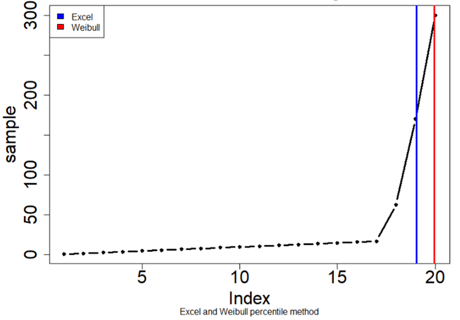

# Descriptive Statistics {#statistics}
This chapter shows how to analyse the water quality data using basic R functions and the Tidyverse extension. This chapter introduces functions to undertake descriptive statistical analysis through averages, medians and percentiles. The learning objectives for this chapter are:
* Analyse data using descriptive statistics
* Distinguish between different methods of percentile calculations
* Group and summarise data

## Problem Statement
The rules of the island of Gormsey has received many complains from people about the quality of the water. The great king has, therefore decided to develop water quality regulations. These regulations look suspiciously similar to the [Australian Drinking Water Quality Guidelines](https://www.nhmrc.gov.au/about-us/publications/australian-drinking-water-guidelines). The ruler of Gormsey has also decreed that they will comply with the Victorian regulations for water quality, the [Safe Drinking Water Regulations](https://www2.health.vic.gov.au/public-health/water/drinking-water-in-victoria/drinking-water-legislation).

The Victorian *Safe Drinking Water Regulations* sets limits for each of these three parameters:
* *Escherichia coli*: All samples of drinking water collected are found to contain no Escherichia coli per 100 millilitres of drinking water, except false positive samples.
* *Total trihalomethanes*: Less than or equal to 0.25 milligrams per litre of drinking water.
* *Turbidity*: The 95^th^ percentile of results for samples in any 12 months must be less than or equal to 5.0 Nephelometric Turbidity Units.

In a separate [guidance document](https://www2.health.vic.gov.au/Api/downloadmedia/%7BA1F6D255-D5C7-4B7E-AAE5-8B7451EDE81A%7D), the regulator also specifies that the percentile for turbidity should be calculated with the 'Weibull Method'.

You are writing the annual report to the regulator about water quality in Gormsey. What was the 95^th^ percentile of turbidity for each of the towns on the island?

## Analyse the Data
The R language is developed for statistical analysis and comes equipped with a lot of specialised functions for statistical analysis. The Tidyverse extends this functionality with the dplyr package that makes it easier to manipulate data.

This chapter discusses [descriptive statistics](https://en.wikipedia.org/wiki/Descriptive_statistics "Wikipedia"), which are methods that summarise data by looking at the mean, median, mode, percentiles variance, distribution curves and so on.

The fastest way to get a quick overview of data is the `summary()` function. This function shows six basic statistics: the minimum value, the first quartile, median, mean, third quartile and the maximum. But before we start doing this, it is best practice to start a new script that loads the data. This way, each script can work independently, which makes your analysis reproducible. A reproducible script can be re-used on different data sets with the same structure.

{format: r, line-numbers: false} 
```
library(tidyverse)
gormsey <- read_csv("casestudy1/gormsey.csv")

summary(gormsey$Result)
```

When you evaluate this function, you see the following output in the console:

```
  Min  1st Qu.  Median    Mean 3rd Qu.    Max. 
0.0000  0.0000  0.0000  0.0822  0.1000  8.8200 
```

This result might be interesting, but our data contains results from three different laboratory tests over eleven different towns. You can use the filter functionality explained in the previous [chapter](#tidyverse "Chapter 3") to focus your data to what you like to know.

Q> What is the mean turbidity result in Pontybridge?

Answer: Filter all results where the `Town` variable is Pontybridge and calculate the mean of the `Results` variable.

{format: r, line-numbers: false} 
```
turbidity_pontybridge <- filter(gormsey, Town == "Pontybridge" & Measure == "Turbidity")
mean(turbidity_pontybridge$Result)
```

The table below shows some of the other descriptive statistical functions you can use in R:

| Function   | Description                           |
|------------|---------------------------------------|
| `mean()`   | Geometric mean                        |
| `median()` | Median                                |
| `sd()`     | Standard deviation                    |
| `min()`    | Minimum value                         |
| `max()`    | Maximum value                         |
| `range()`  | A vector of minium and maximum values |

X> Try these functions with the Gormsey data to hone your coding skills.

{width: 50%}
.

## Calculating Percentiles
The `summary()` function is useful for a quick overview, but not very useful in detailed analysis because it has little flexibility. The `quantile()` function calculates the percentiles of a vector of numbers. The default setting gives five values, similar to the `summary()` function. 

For example, `quantile(turbidity_pontybridge$Result, 0.95)` results in the 95^th^ percentile of the turbidity measurements in Pontybridge. The quantile function can also take a vector of one or more probabilities to calculate different outcomes, for example `quantile(turbidity_pontybridge$ Result, c(0.50, 0.95))` results in a vector with two variables.

Q> What is the 33rd percentile for the NTU data in Paethsmouth?

To answer this question, you first need to create a subset of the data using the `filter()` function, after which you can calculate the required percentile.

{format: r, line-numbers: false} 
```
thm_paethsmouth <- filter(gormsey, Town == "Paethsmouth" & Measure == "THM")
quantile(thm_paethsmouth$Result, 0.33)
```

In the [first chapter](#datascience), we saw how Good data science needs to be valid and reliable. The validity and reliability of the measurements relate to the design, installation and maintenance of the instruments that measure the parameters of interest.

The soundness of good data science also requires an appropriate methodology to analyse the data. This case study has some specific requirements concerning how to analyse the data. The guidance document from the regulator raises two questions: What is the Weibull method? How do you implement this method in R?

The process to determine a percentile consists of three steps (McBride, [2005](http://amzn.to/2k8shr8)):

1. The numbers are placed in ascending order: `y_1, y_2, \ldots y_n`$.
2. Calculate the rank (`r`$) of the required percentile.
3. Interpolate between adjacent numbers: `x_p=(1-r_{frac})Y_{r_{int}}+r_{frac}Y_{r_{int+1}}`$

Where:
* `r_{frac}`$: Decimal fraction of the ranking.
* `r_{int}`$: Rounded ranking.

With 52 ranked weekly turbidity samples, the 95^th^ percentile is logically between sample 49 and 50 (0.95 times 52). However, this method is only valid for normally-distributed samples. 

Statisticians have defined several methods to determine percentiles. The difference between these approaches is the rule to determine the rank `r`$. Hyndman & Fan ([1996](https://www.researchgate.net/publication/222105754_Sample_Quantiles_in_Statistical_Packages)) give a detailed overview of nine methods of calculating percentiles or quantiles. This paper gives the Weibull method the less poetic name `\hat{Q}_6(p)`$ because it is the sixth option in their list. Waloddi Weibull, a Swedish engineer famous for his statistical distribution, was one of the first to describe this method. The rank of a percentile `p`$ is given by:

```$
r_{weibull} = p(n + 1)
```

For a sample of 52 turbidity tests, the percentile thus lies between ranked result number 50 and 51. This method gives a higher result than the method described above. This method is suitable for positively skewed samples, as is often the case with water quality data. We often see a lot of low values, with the occasional spikes of high values.

Please note that there is no one correct way to calculate percentiles. The most suitable method depends on the distribution of the population and the purpose of the analysis. In this case study, the method is prescribed by the regulator.

The `percentiles.R` script in the `casestudy1` folder compares the Weibull method with the results from Excel (Figure 4.1). With highly skewed data, as is often the case with turbidity measurements, the Weibull method results in a higher percentile value.

{width: 60%}


Q> Open the percentiles script and run the code. Reverse-engineer the code to understand how it works.

## Analysing Grouped Data
In the previous paragraphs, we had to create a filtered set of data to determine statistics for a specific town and parameter. This last function simplifies this task by grouping a data set and analysing the data for each group.

The `group_by()` function in the dplyr library splits the data into subsets. Grouping is a powerful function that cuts a data frame into groups. Figure 4.2 shows an example. The data frame contains three variables, `group` `var` and `val`. Lets assume we want to analyse `val` by `var`

{width: 60%}


We can use this special type of table to compute summary statistics for each group using the `summarise()` function. For example, to calculate the average and maximum value of the Result, grouped by measure, you first group the data and then run a summary.

The first lines create a mini data frame, as shown in figure 4.2. The numbers in the Result column are randomly chosen. The data is grouped by the measure. When you display a grouped data frame in the console, R mentions the number of groups and the variables. 

{format: r, line-numbers: false} 
```
df <- tibble(Town = rep(c("Bellmoral", "Blancathey", "Merton"), each = 2),
             Measure = rep(c("THM", "Turbidity"), 3),
             Result = runif(6))
df

df_grouped <- group_by(df, Measure)
df_grouped 

summarise(df_grouped,
          Average = mean(Result),
          Maximum = max(Result))
```

The `summarise()` function uses the grouped data frame and creates two new variables that show the average and maximum values for each measure.

| Measure   | Average | Maximum |
| THM       | 0.589   | 0.679   |
| Turbidity | 0.326   | 0.794   |

{width: 50%}


We can now apply this abstract concept to the water quality case study. You can also group a data frame or tibble by more than one variable. The result of this code is a new data frame that shows the average result by Town and by measure. In the [next chapter](#ggplot "next chapter"), we will visualise these results.

{format: r, line-numbers: false} 
```
gormsey_grouped <- group_by(gormsey, Town, Measure)
summarise(gormsey_grouped, mean = mean(Result))
```

You now have all the tools you need to analyse the Gormsey data and determine how the results compare to the regulations.

X> Click on the link below to complete the quiz or move the [next chapter](#visualise). You can also practice on your own data generating summary statistics and grouping data frames.

{quiz, id: q3, attempts: 10}
# Quiz 3: Analysing Water Quality Data

X> Load the Gormsey data and explore it using the tools described in this chapter.

T> Answering these questions requires more than one step. First filter and, if needed, group the data frame, and then you can calculate the results.

? What is the median THM value for all towns in Gormsey? 

A) 0.0085
b) 0
c) 0.1
d) 0.25

? Which town has breached the regulations for THM most? The limit is 0.25 mg/l.

a) Gormsey
b) Bellmoral
c) Wakefield
D) Southwold

? Which town in the Gormsey town shows the highest level of turbidity?

a) Swadlincote
b) Pontybridge
C) Strathmore
d) Bealiba

? What is the average 95^th^ percentile of the turbidity for the towns in Gormsey, using the Weibull method?

A) 0.777
b) 8.82
c) 0.3
d) 7.34

That's it for this quiz. If you get stuck, you can find the answers in the `quiz_03.R` file in the `casestudy1` folder, or watch the video below.

{width: 60%}


In the [next chapter](#ggplot), we will visualise the results of your analysis.
{/quiz}

