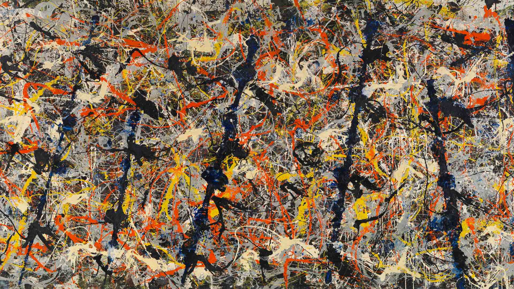
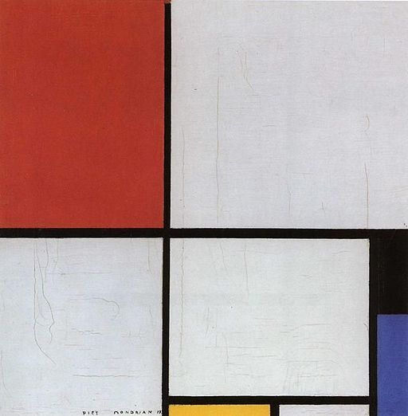

# Visualising Data with ggplot {#ggplot}

This chapter introduces the principles of data visualisation and some basic techniques to 
	
## Learning Objectives
1. Identify best practice in data visualisation
2. Diagnose data visualisations and describe how they can be improved
3. Visualise water quality data with the ggplot2 library

## Principles of visualisation
Data visualisations are everywhere. They are no longer the domain of scientific publications and business reports. Publications in every medium use graphs to tell stories. The internet is awash with infographics on a wide range of topics. These popular images are often data science porn because they are designed to entertain and titillate, with limited usability from a business perspective. They are a fantastic tool to supply information to customers but should not be used to report data science.

Aesthetics and usefulness go hand in hand. Some data visualisations in engineering remind me of a [Jackson Pollock](https://en.wikipedia.org/wiki/Jackson_Pollock) painting (Figure 4.1). Engineers love to maximise the number of visual elements in a graph, with lines and colours splashed across the screen. Adding too much information to a graph and using too many colours reduces its usability. When visualisation is not aesthetic, it becomes harder to interpret, which leads to the wrong conclusions and can even deceive the user.

{width: 70%, alt: "Jackson Pollock, Blue Poles number 11."}

Perhaps a good data visualisation should look more like a painting by [Piet Mondrian](https://en.wikipedia.org/wiki/Piet_Mondrian) who is famous for his austere compositions with straight lines and primary colours (Figure 4.2). Using art to explain data visualisation is not an accidental metaphor because visual art represents how the artist perceives reality. This comparison between Pollock and Mondrian is not a judgement of their artistic abilities. For Pollock, reality was chaotic and messy, while Mondrian saw a geometric order behind the perceived world.

{width: 50%, alt: "Piet Mondrian, Composition in Red, Yellow and Blue."}

### Telling Stories
First and foremost, visualisation needs to tell a story. The story in data visualisation should not be a mystery novel. A visualisation should not have suspense but get straight to the point. Trying to squeeze too much information into one graph confuses the reader. Ideally, each visualisation should contain only one or two narratives. If there is more to tell, then use more charts and create a dashboard.

Numerical data can contain several types of narratives. A graph can compare data points to show a trend among items or communicate differences between them. Bar charts are the best option to compare data points with each other. A line graph is possibly your best option to compare data points over time. The distribution of data points is best visualised using a histogram. Scatter plots or bubble charts show relationships between two or three variables (Figure 4.3).

{width: 70%}

Every visualisation needs to tell a story and not just summarise a bunch of data. The detailed considerations of choosing the most suitable visualisation are outside the scope of this book. The internet contain many tools to help you with this choice. [Andrew Abela](https://extremepresentation.typepad.com/blog/2008/06/visualization-taxonomies.html) developed one of the earliest examples of a tool to choose the most suitable visualisation. The [R Graph Gallery](https://www.r-graph-gallery.com/) provides some guidance on the methods available in R.

{quiz, id: quiz1}
X> Use the Chart Chooser or the R Graph Gallery to determine the best way to visualise the following examples of data.

? How many letters are in the word Markua?

a) 5
B) 6
c) 7

? How many unique letters are in the word Markua?

! 5
{/quiz}

## Visualising data with ggplot
The Tidyverse set of packages contains *ggplot2*, one of the most powerful data visualisation tools. This package follows a layered approach to visualising data, which simplifies the process of producing sophisticated graphics. This session introduces the basics of *ggplot2* using the Laanecoorie water quality data from the first case study.

### The Grammar of Graphics
The ggplot2 library applies the grammar of graphics developed by Leland Wilkinson. This grammar is an approach to systematically develop visualisations in logical layers (Figure 4.5). 

The data exists at the lowest level, without which there is nothing to visualise. The aesthetics define which variables of the graph are visualised. These are generally the axes and any grouped colouring of the data.

The geometries are the various types of graphs, such as a bar plot, line chart box plot and so on. Many visualisations contain a lot of information, which can lead to confusing images with many lines. Facets are a way to create a grid in your visualisation that separates the geometries for easy comparison. The statistics relate to any specific transformations to summarise the data, such as trend lines. 

Lastly, each graph has a coordinate system and a theme that defines colours, fonts and so on.

The ggplot functions use this vocabulary and layered approach to build visualisations. The next section shows various examples using the Laanecoorie water quality data.
