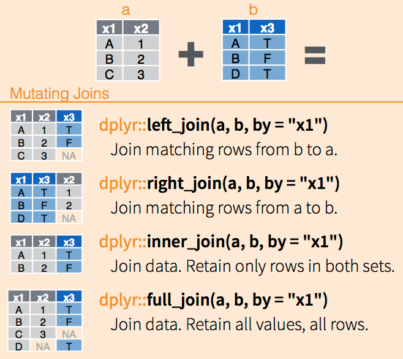

# Cleaning Data {#cleaning}
The data that we used in the first case study was perfect in many ways. There were no superfluous columns or missing observations, everything was perfectly labelled, ready to be analysed. Data in the real world is, however, not always this clean. This chapter introduces some techniques to clean data with R and the Tidyverse to create reproducible code.

The learning objectives for this session are:
* Select columns in a data frame
* Join two data frames 
* Developed piped code for greater efficiency

## Case Study 2
The case study for the next four chapters uses data obtained from a sample of customers in three Gormsey towns. Magnus Delarosa, the Grand Wizard of the Gormsey water utility, decided that it would be good to know how the people of Gormsey think about their water services. He sent ravens out across the land and dropped surveys of at a sample of people in three cities. The consumers completed a series of questions and sent the results back to the alchemist. 

Magnus has two questions: 
1. How much do people care about the service that the Invisible Water Utility provides? 
2. How happy the people of Gormsey are with their service provider. 

He devised a survey that includes a series of questions for a sample of customers in three towns. The results of the survey are stored in a CSV file. Your task over the next four sessions is to analyse the results of this survey.

## Cleaning data
Many data science practitioners know that cleaning data can be 80% of the work. Cleaning data is fundamental because even the most advanced algorithm can't create value from dirty data. As the old adagio goes: "rubbish-in is rubbish-out". The following code snippets show how to clean this survey data using reproducible code. 

Using code to clean data is better than to manually manipulate data in Excel because with code, the process of changing the data is transparent, and the original raw data still exists. The process can always be rolled back. Using code to clean data is also reproducible because it can be repeated with other raw data sets that have the same structure.

### Load and explore the data
The results of the survey are stored in the `casestudy1` folder in the `customer_survey.csv` file. This data is the raw data as collected from the online survey system.

X> Open a new R script and load the data. Explore the content with some of the techniques you have learned so far. 

{format: r, line-numbers: false}
```
library(tidyverse)
rawdata  <- read_csv("casestudy2/customer_survey.csv")
glimpse(rawdata)
```

We use `rawdata` as the variable name because we want to keep this data intact as we process it, in case we need to use it again.

The output of the `glimpse()` function shows that this data contains over fifty variables. You will note that the class of all variables in the raw data is a character.

Q> How many rows and columns of data does this data have?

The output of the `glimpse()` function shows that the first 19 columns contain metadata, such as a unique response ID, IP addresses, start and end times, and so on. The next 35 columns contain the actual data.

Looking at the data with the `View()` function, we see that the first two rows contain header information. Many open data files contain more than one header row, or they contain redundant information at the bottom, such as totals or other calculations. A clean data set should have only one header row. Because of the double headers, R thinks that all columns are text. 

The first row contains the questions as they appeared on the survey, while the second row contains abbreviated variable names. We thus need to remove the first row and re-assess the data types to create a clean table.

{format: r, line-numbers: false}
```
customers <- rawdata[-1, ]
customers <- type_convert(customers)
glimpse(customers)
```

The readr package assumes that the first for contains the variable names. The first line of code creates the new `customers` data frame by removing the first line of the raw data, which includes the questions. Using negative numbers in data frame indices removes them from the output.

The `type_convert()` function re-assesses the variables to guess the correct data types. Using the `glimpse()` function again, we can see that most columns are now numerical values, which is what we want them to be.

The `read_csv()` function can also skip several lines in a file. When you evaluate the expression below, R ignores the first line and uses the second line as the header. Only one line of data is read. The code then extracts the names of the new data frame to create a vector with the questions.

{format: r, line-numbers: false}
```
questions <- read_csv("casestudy2/customer_survey.csv", skip = 1, n_max = 1)
questions <- names(questions)
```

X> Try the version with skipping the first line and note the difference in the variable names.

### Remove unwanted responses 
The next step is to remove any respondents that either:
* Did not consent to their data being used
* Don't have tap water
* Don't live in one of the three nominated towns
* Did not pay attention when completing the survey

The first questions on the survey asks for consent to use the responses. Informed consent is the first principle of ethical data science. The survey also asks whether the respondent has tap water and which city they live in. One of the problems with using paid survey subjects is that they are motivated to complete many surveys, without having much regard for their answers. Respondents were therefore also subjected to an attention filter: "If you live in Gormsey then select Strongly Agree". The survey was only sent to people within Gormsey, so everybody should respond equally. Any respondent who did not answer "Strongly Agree" is as such excluded from the survey.

The `term` field stores why a respondent terminated the survey or whether they  did not pay attention. To summarise the content of this field, we can use the `table()` function. This function creates, as expected, a table with a count of the unique elements in a vector.

{format: r, line-numbers: false}
```
table(customers$term)
```

The output of this function shows that 79 people did not pass through the attention filter, 8 did not consent, 15 did not have tap water, and 97 lived outside Gormsey.

You might notice that the total number of items in the table does not match the number of rows (observations) in the data frame. When you view the content of the `customers$term` field, you see many entries with `NA` in them. These are empty values (Not Available). R uses this code to better manage missing values. The table function can include `NA` values with the `useNA="ifany"` option:

{format: r, line-numbers: false}
```
table(customers$term, useNA = "ifany")
```

The `table()` function forms part of the core R functionality. In the previous case study, we already saw the `count()` function of the Tidyverse. This function always counts `NA` values. Another advantage of this function is that the output is a data frame, which we can use for further calculations or visualise with ggplot2.

{format: r, line-numbers: false}
```
term <- count(customers, term)
ggplot(term, aes(term, n)) +
    geom_col()
```

We only want those rows of data that have an `NA` value in the `term` field, as these are the surveys that were not terminated. To find these observations, we need to use a special function. The `is.na()` function results in a logical variable (`TRUE` or `FALSE`) that shows whether a field is not available. Try `is.na(customers$term)` to see the result. The next line of code filters the customer data by only those that have `NA` in the `term` field. You cannot use `term == NA` because this is a special condition. More about `NA` values in the next session.

{format: r, line-numbers: false}
```
customers <- filter(customers, is.na(term))
nrow(customers)
```

To see all respondents that did not complete the survey, you can negate the `ìs.na(term)` statement with an exclamation mark (the not function): `filter(customers, !is.na(term))`. The exclamation mark indicates a logical negation and thus reverses the value of the condition. For example: `!(3 == 3)` results in `FALSE`.

### Remove unwanted variables
The survey data contains metadata that we don't need for further analysis. The first 19 columns contain information about when the survey was taken and so on. The next step is to remove the metadata and the `trap` question, which was used as the attention filter.

In the dplyr package, the `select()` function works just like the filter function, but for columns. You can use numbers or names to indicate the required columns. In this case, we like to keep the first column, which is the unique id for each respondent, and the columns with survey responses, excluding the attention question. The easiest way to do this is to remove columns 2 to 19 and column 34 by using negative numbers.

{format: r, line-numbers: false}
```
customers <- select(customers, c(-2:-19, 34))
```

The penultimate step is to improve the name of the first variable `V1`. We like to rename this to `survey_id` because that is a bit more descriptive. The names of the other variables (`p01` etc.) seem cryptic, but they will be explained in the [next chapter](#customers).

The `rename()` function from the dplyr package changes, as the name suggests, the name of variables in a data frame.

{format: r, line-numbers: false}
```
customers <- rename(customers, survey_id = V1)
```

## Joining data frames
The last step is to replace the number for the towns in the `city` variable. We do this by merging the data with a control table. This is a table contains the relationship between the numbers and the names of the towns. In this case study, the three surveyed villages are:

1. Merton
2. Snake's Canyon
3. Wakefield

Control tables are often needed in surveys that have drop-down boxes to provide answers as the data is often stored as numbers.

First, we create the control table to link the numbers with towns, which is then joined to the primary data. 

{format: r, line-numbers: false}
```
cities <- tibble(city = 1:3,
                 city_name = c("Merton", "Snake's Canyon", "Wakefield"))
cities

customers <- left_join(cities, customers)
```

The `left_join` function finds the matching fields in the two sets and then merges the sets. You can specify the specific column names with the `by = "city" ` option. Since both data frames have a variable named `city`, the function automatically matches these fields. This function keeps all the values in the left data set (the survey results) while linking it with the data in the second data frame (the cities). 

This function returns all rows from the first tibble (`x`), and all columns from both tibbles (`x` and `y`). Rows in `x` with no match in `y` will have `NA` values in the new columns. If there are multiple matches, all combinations of the matches are returned.

If one of the city variables in the customer data would contain a number that is not in the control table, the `city_name` variable would become `NA`. If the control table has missing matching references, the result is also `NA`.

The Tidyverse has several other [join functions](https://dplyr.tidyverse.org/reference/join.html) that match values in different ways (Figure 7.1). The `left_join()` function is the most common way to join two data sets.



We now have a clean data frame that we can use in further analysis. The last step saves this data to disc so that we can reuse it in the next sessions.

## Code structure
The sequence of functions explained above cleans the data for further analysis from the raw data to the finished product. This code contains a lot of repetition because we change the `customers` variable several times in a sequence. In summary, we take the following steps:

{format: r, line-numbers: false}
```
customers <- rawdata[-1, ]
customers <- type_convert(customers)
customers <- filter(customers, is.na(term))
customers <- left_join(customers, cities)
customers <- select(customers, c(-2:-19), 34)
customers <- rename(customers, id = V1)
```

A rule-of-thumb in coding is that if you repeat the same thing more than twice, there will be a more efficient way of achieving the same result. There are two ways of combining these lines of code.

A typical way to code in a spreadsheet is to join the steps in a nested formula. While the nested approach uses less space, it is not as easy to understand because you have to read from the inside out instead of from top to bottom or left to right.

{format: r, line-numbers: false}
```
customers <- rename(select(left_join(filter(type_convert(rawdata[-1, ]), is.na(term)), cities), c(-2:-21, -34)), survey_id = V1)
```

The [Magrittr package](https://magrittr.tidyverse.org/) within the Tidyverse uses the pipe operator to streamline this process. A pipe transports the output of one function to the input of the next one. A pipe replaces `f(x)` with `x %>% f()`, where `%>%` is the pipe-operator. This code means that R pipes the value of `x` to the function `f()`. This step can be repeated in a long sequence. The code used to clean the customer data is now written like this:

{format: r, line-numbers: false}
```
customers <- rawdata[-1, ] %>%
    type_convert() %>%
    filter(is.na(term)) %>%
    left_join(cities) %>% 
    select(c(-2:-19, 34)) %>%
    rename(survey_id = V1)
```

The raw data without the first row is piped to the type converter. The output of this step goes to the filter, to the join function, and so on. The name of the customers variable only appears once because it is transported through the pipe. The pipe operator always moves the output of the previous step to the first parameters in the next function.

The best way to understand this piped code is to evaluate it step by step and review the output. You can select bits of the code and run them separately. Time for some practice.

X> Review some of the code in [chapter 5](#analyse) and rewrite it as a pipe.

We now have a reproducible script that can be reused every time we run this same survey. This approach promotes the reproducibility of the analysis. This approach also allows for peer review of the analysis to assure its soundness.

Now that we have a clean set of data and some new knowledge, it is time for another quiz.

## Quiz 4: Cleaning Data

{quiz, id: q4, attempts: 10}
# Quiz 4: Cleaning data
The following five questions test your comprehension of some of the functionality explained in this chapter. Test your answer by executing the code in the console. Any files are available in the `casestudy2` folder.

? You receive a CSV file from a colleague. The first five rows of this data look like the table below. How do you read this CSV file into memory?

```
This file contains lots of data.
id  Date       Measurement Type
a1  2020-12-02        12.3   A
a2  2020-12-03         7.6   A
a3  2020-12-04         2.3   B
```

a) `read_csv("casestudy2/quiz4.csv")`
B) `read_csv("casestudy2/quiz4.csv", skip = 1)`
c) `read_csv("casestudy2/quiz4.csv", n_max = 1)`
d) `read_csv("casestudy2/quiz4.csv", skip = 1, n_max = 5)`

? You want to write a single piece of code that reads a CSV file and removes the second column. What is the best way to achieve this?

A) `df <- read_csv("casestudy2/quiz4.csv", skip = 1) %>% select(-2)`
b) `df <- select(read_csv("casestudy2/quiz4.csv", skip = 1), -2)`
c) `df <- read_csv("casestudy2/quiz4.csv"); df <- select(df, -2)`
d) `df <- read_csv("casestudy2/quiz4.csv"), select(-2)`

The `casestudy2` folder also contains the results of an employee survey. You need to write some code to clean this data so that you can answer the following questions:

? How many employees did not consent to the survey?

a) 184
B) 1
c) 0
d) 185

The `engineer` variable indicates whether a respondent has engineering qualifications. The `marketing` variable indicates that a respondent has marketing or customer service qualifications.

? How many respondents have both engineering and marketing qualifications?

A) 9
b) 0
c) 3
d) 184

? You want to visualise the number of employees per department. Complete the following ggplot function call:

`ggplot(employees, aes(department)) + `
`    geom_...()

a) boxplot
b) column
c) histogram
D) bar

That's it for the fourth quiz. If you get stuck, you can find the answers in the `quiz_04.R` file in the `casestudy1` folder. You can also watch the video to see the solutions.

{width: 60%}


Before you proceed to the [next chapter](#customers), try and load a CSV file you use in your daily work and manipulate the data to practice your skills.
{/quiz}
