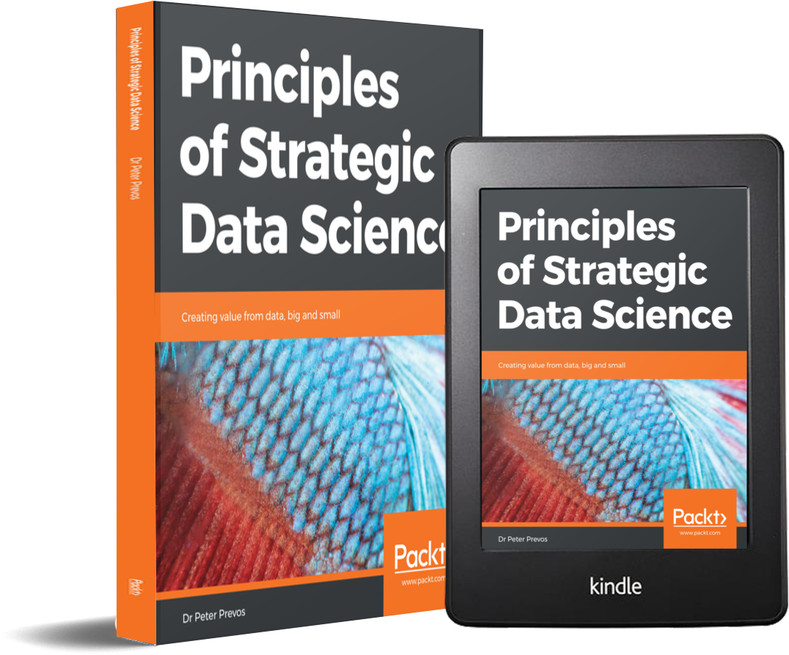
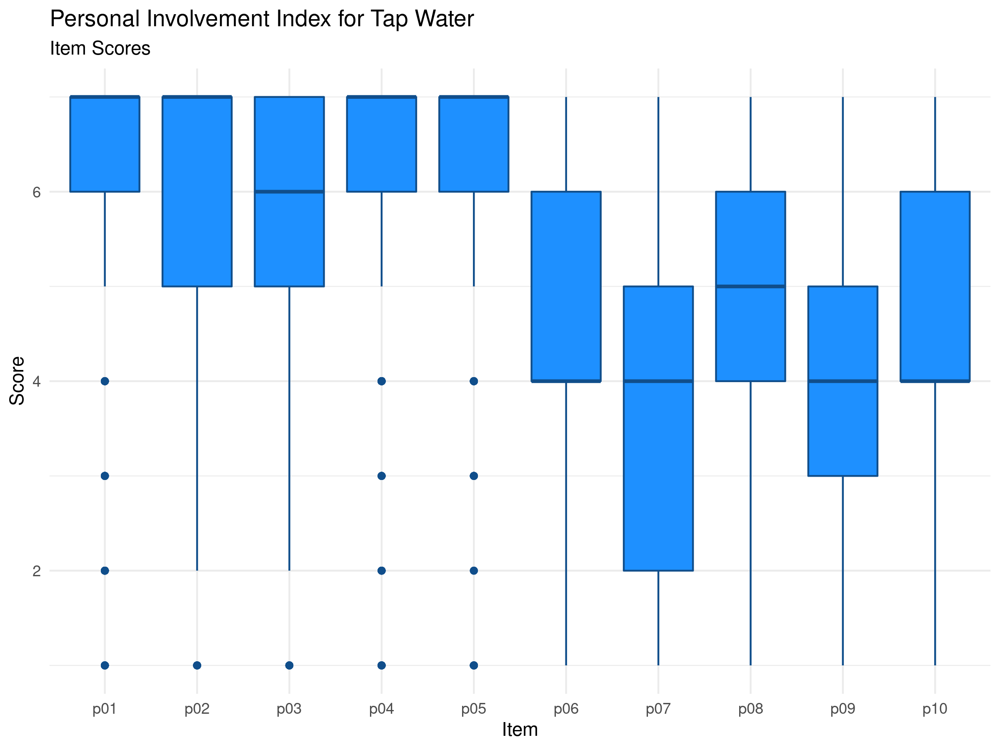
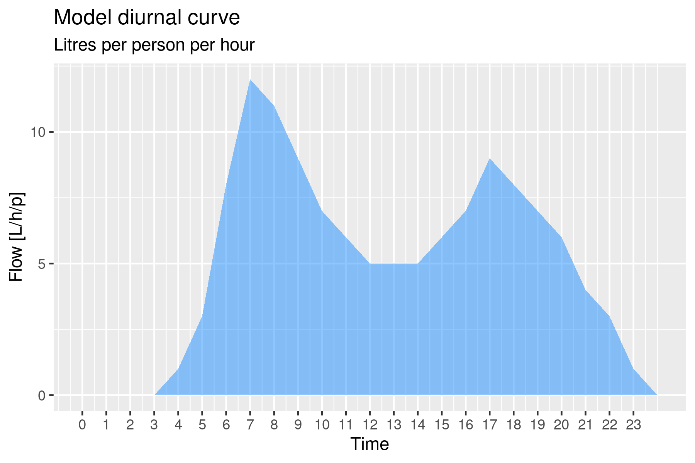
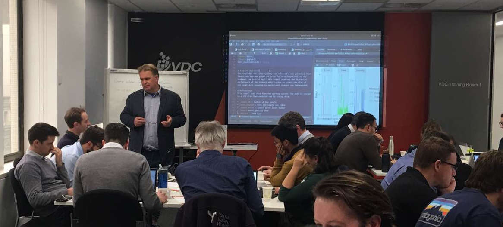

The course consists of seven sessions. The introduction introduces the principles of data science within the context of managing a water utility. The three case studies look at water quality data, customer perception and digital metering data. The case studies use material previously published on [The Devil is in the data](https://lucidmanager.org/data-science/), a blog about creating value and having fun with the R language.

Each of the case studies starts with a problem statement and introduces participants to the relevant aspects of the R language. Participants have to load, transform, explore and analyse the data to solve the stated problem.

## Principles of Water Utility Data Science
The [first chapter](#datascience) defines data science as an evolution of traditional analysis. The greater availability of data, enhanced computer capacity and tools to analyse this information have revolutionised the industry.

This course is not only about the vocabulary and syntax of R, but also about doing good data science. This session introduces a framework for best practice in analysing data and sharing the results. This framework derives from the book [Principles of Strategic Data Science](https://www.packtpub.com/big-data-and-business-intelligence/principles-strategic-data-science) by Peter Prevos. The three case studies each implement aspects of this framework.

{width: "50%", alt: "Principles of Strategic Data Science.", align: "middle"}

## Introduction to the R Language
The [second chapter](#basics) introduces the basic principles of the R language and applies these principles to measure the flow in an open channel.

{width: "80%", alt: "Open channel (Photo: Coliban Water).", align: "middle"}

## Case Study 1: Water Quality Regulations
In this [first case study](#casestudy1), participants apply their skills to laboratory testing data. The case study revolves around checking the data for compliance with water quality regulations.

The analysis uses the Tidyverse library. The  is a collection of extensions of the R language that simplifies manipulating, analysing and presenting data science. 

## Visualising Data
The [fourth chapter](#tidyverse) delves into the basic principles of visualising data with the ggpot2 library, using data from the first case study.

{width: "80%", alt: "Distribution of turbidity results.", align: "middle"}

## Data Products
The [fifth chapter](#dataproducts) focuses on the data science workflow as an iterative process to solve a data problem. A data product is the result of a data science project, which can be a report, website or an application.

This session introduces R Markdown as a tool to report on the results of a data science project. In this session, students prepare a report to summarise the impact of proposed changes to water regulations on the data in the first case study.

## Case Study 2: Understanding Customer Perception
The data for the [second case study](#casestudy2) consists of the results of a survey of American consumers about their perception of tap water services. Participants use the Tidyverse to clean, transform and visualise this data.

{width: "80%", alt: "Consumer involvement with tap water.", align: "middle"}

## Case Study 3: Analysing Water Consumption
In the [last case study](#casestudy3), participants use the advanced functionalities of the Tidyverse to analyse data from smart meters to find anomalies in water consumption. 

{width: "80%", alt: "Digital metering diurnal curve.", align: "middle"}

## Hackathon
The hackathon is under development.

## Participant Activities
Besides the case studies, the content of this course contains several activities for participants. These icons are used throughout the text to indicate these activities:

Q> Questions to apply the course content (The answers are provided below the questions.

X> Tasks to undertake to progress the course.

T> Tips and suggestions for further study.

The course also contains several multiple-choice exercises to test your comprehension of the content.

## Face-to-Face Sessions
This course is occasionally also provided in face-to-face sessions. The one-day course covers the first four chapters and provides a overview of the functionalities of the R language, R Studio and the Tidyverse. The three-day version delves deeper into the subject and provides two further case studies for participants to analyse. The last day consists of a hackathon where participants work on a problem, create a data product and present this to the group. Participants can work on the defined case study or bring their own data to analyse.

| Day   | Topic                    |
|-------|--------------------------|
| One   | Data Science Principles  |
|       | Basics of the R language |
|       | Data visualisation       |
|       | Data products            |
| Two   | Voice of the customer    |
|       | Digital metering         |
| Three | Hackathon                |

{width: "100%", alt: "R for Water Professionals workshop (Melbourne, 2019).", align: "middle"}

## Prerequisites
To participate in this workshop, you need to have some understanding of the issues surrounding water management. Experience with analysing data is also preferred. This course is designed with spreadsheet users in mind. Experience with writing computer code is helpful, but not required.

The repository contains several folders:
* `introduction` : Introduction to the R language.
* `casestudy1`   : Case study data and files.
* `casestudy2`   : Case study data and files.
* `casestudy3`   : Case study data and files.
* `manuscript`   : Course syllabus (best viewed through the [LeanPub website](https://leanpub.com/c/R4H2O)).
* `cheatsheet`   : Cheat sheet for the functions needed to complete the exercises.
* `presentations`: Slides.

The [next chapter](#datascience) introduces the principles of data science and presents a framework for good data science.
	
