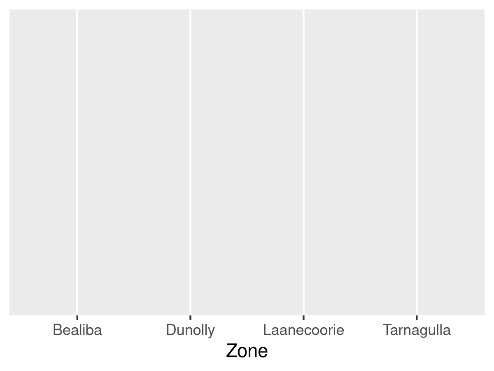
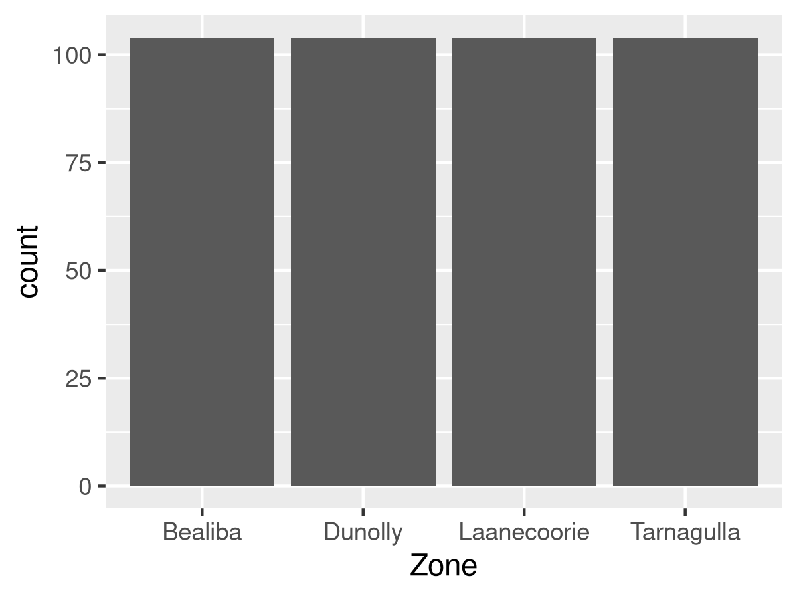
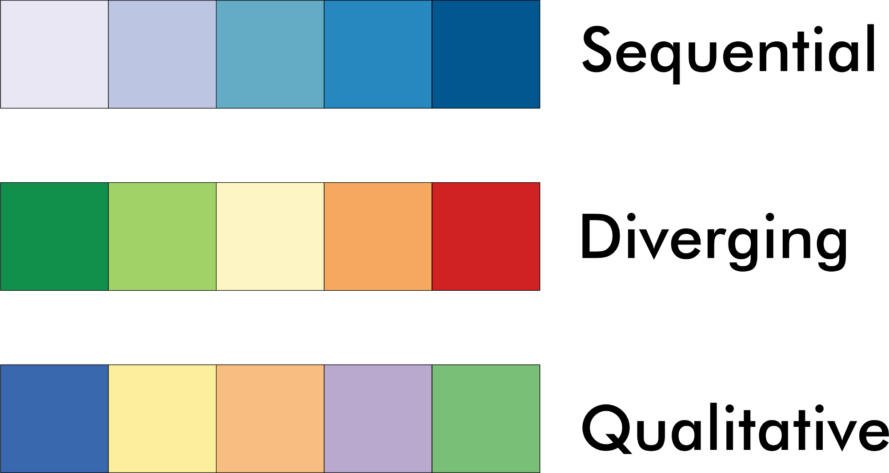
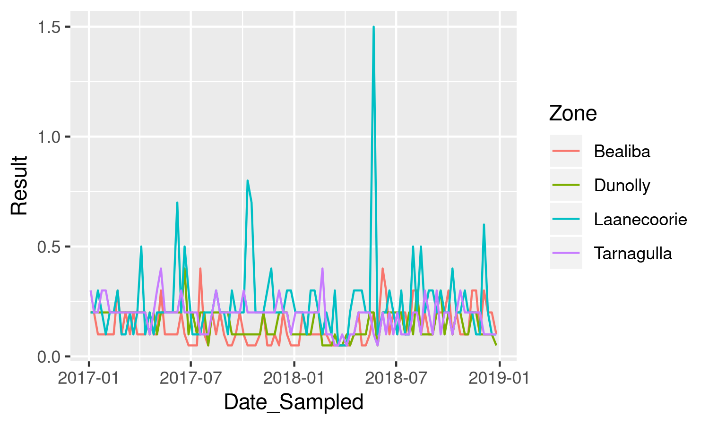
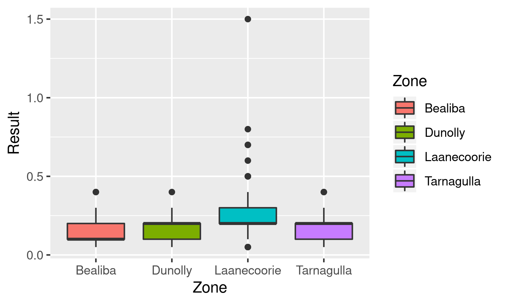
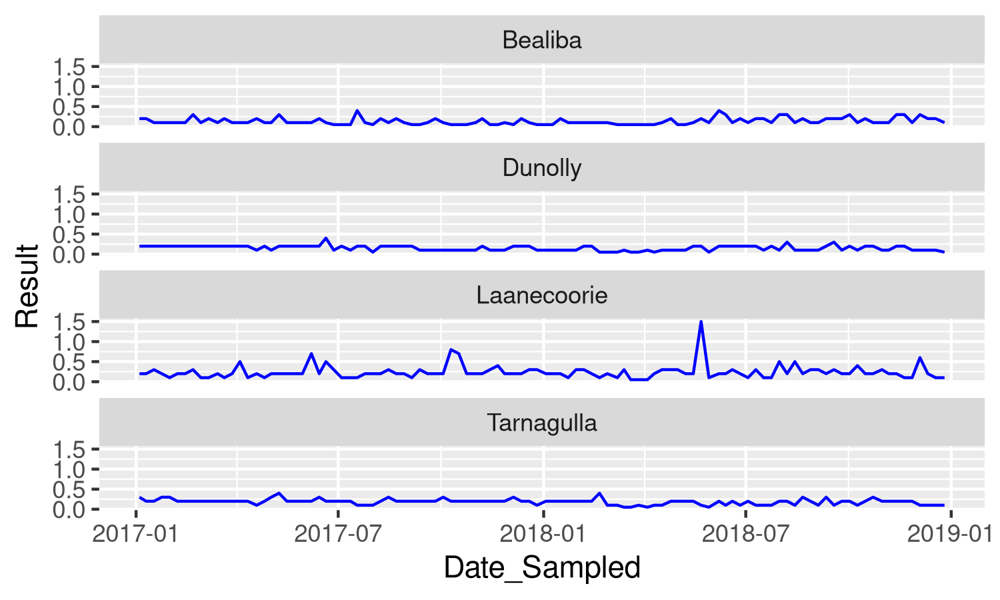
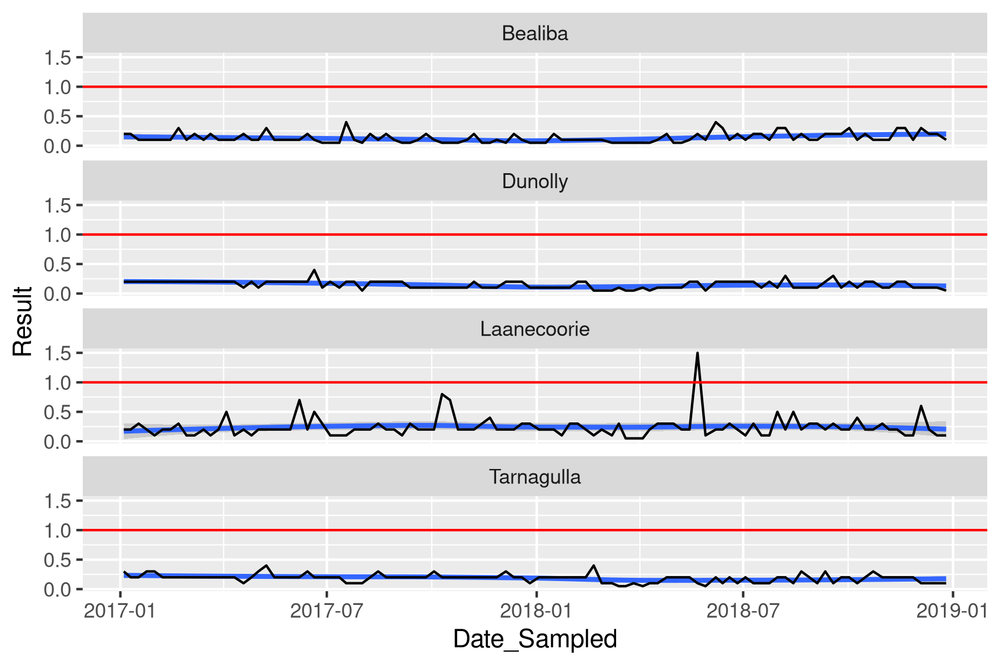
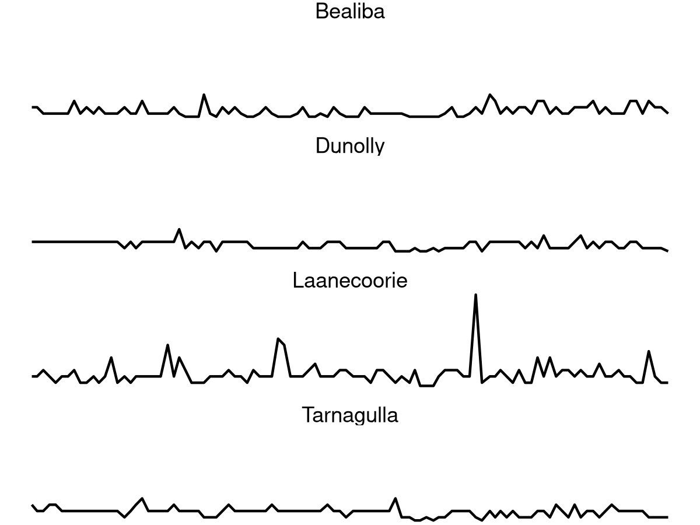
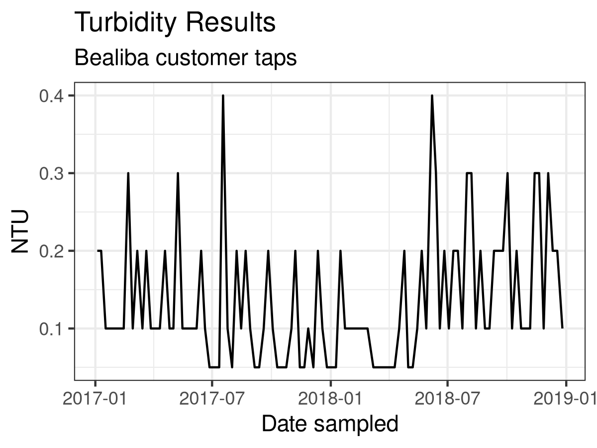

# Visualising Data with ggplot2 {#tidyverse}


A data scientist needs to be aware of cognitive biases to prevent them and create data products that don't deceive. Many of these biases relate to how information is presented.

Our perception is not always an accurate representation of reality, and we often misinterpret the images that our retina collects. Optical illusions are funny internet memes, but they also occur in real life. Besides optical illusions, messy visualisations are hard to interpret because our mind does not know what element to focus on. A messy graphic confuses the brain so that it starts to form its interpretations.


Although visualising data has some parallels with art, it is very different. All works of art are a form of deception. The artist paints a three-dimensional image on a flat canvas, and although we see people, we are just looking at blobs of paint. Data visualisation as an art form needs to be truthful and not deceive, either intentionally or accidentally. The purpose of any graph is to validly and reliably reflect reality.

Aesthetic data science is not so much an art as it is a craft. Following some basic rules prevents confusing the consumers of data products. Firstly, visualisation needs to have a straightforward narrative. Secondly, visualising data should be as simple as possible, minimising elements that don't add to the story.


### Visualisation Design
Beauty is in the eye of the beholder, and there are no formulas or algorithms to ensure perfect visualisations. The social network Reddit has two groups dedicated to visualisations. Users members of the [Data is Ugly](https://reddit.com/r/dataisugly/) and [Data is Beautiful](https://reddit.com/r/dataisbeautiful/) groups share images of visualisations they consider ugly or beautiful. These two groups sometimes share the same visualisations because of different interpretations of aesthetics in data. What is a beautiful visualisation to one person, is an abomination to somebody else. The aesthetics of data visualisation is for a significant part in the eye of the beholder. However, when viewing aesthetics from a practical perspective, we can define what this means with a simple heuristic.


Edward Tufte is an American statistician who is famous for his work on visualisation. Tufte introduced the concept of the data-ink ratio. In simple terms, this ratio expresses the relationship between the ink on the paper that tells a story and the total amount of ink on the paper. Tufte argues that this ratio should be as close to one as possible. In other words, we should not use any graphical elements that don't communicate any information, such as background images, superfluous lines and text.

Now that we are in the paperless era, we can use the data-pixel ratio as a generic measure for the aesthetics of visualisations. The principle is the same as in the analogue days. Unnecessary lines, multiple colours or multiple narratives risk confusing the user of the report.

The data-ink ratio is not a mathematical concept that needs to be expressed in exact numbers. This ratio is a guideline for designers of visualisations to help them decide what to include and, more importantly, what to exclude from an image.

Figure 4.4 shows an example of maximising the data-ink ratio. The bar chart on the left has a meagre data-pixel ratio. The background image of a cat might be cute and possibly even related to the topic of the visualisation, but it only distracts from the message. Using colours to identify the variables is unnecessary because the labels are at the bottom of the graph. The legend is not very functional because it also duplicates the labels. Lastly, the lines around the bars have no function.

To improve this version, all unnecessary graphical elements have been removed. Assuming that the story of this graph is to compare variables, the columns have been ranked from large to small. If the narrative of this graph was to compare one or more of the variables with other variables, then groups of bars can be coloured to indicate the categories.

The basic rule of visually communicating data is to not 'pimp' your visualisations with unnecessary graphical elements or text that does not add to the story. When visualising data, austerity is best-practice.

{width: 70%}


### Aesthetics
The primary *ggplot* function starts with the name of the data frame, followed by the aesthetics. The aesthetics consist of the fields used to visualise the data. 

{format: r, line-numbers: false}
```
library(tidyverse)
turbidity <- read_csv("casestudy1/turbidity_laanecoorie.csv")

ggplot(turbidity, aes(Zone))
```

If you run this function, the result is an empty canvas with space for the variables that are being plotted. This example only considers the `Zone`, which ggplot places on the x-axis (Figure 4.6).

{width: 70%}


To visualise the zones, we need to add a geometry. Given that the zones are a qualitative variable, the only thing we can do with it is count the number of samples in each zone. The `geom_bar()` function counts the number of occurrences of each zone and plots them as a bar chart (Figure 4.7).

{format: r, line-numbers: false}
```
ggplot(turbidity, aes(Zone)) + 
    geom_bar()
```

In ggplot, the layers are connected with a `+` sign. It is common practice to start a new line after each layer to create readable code. RStudio can automatically indent code by selecting the relevant lines and pressing Control-I.

If we don't write anything between the parenthesis, then ggplot will create simple chart. The *ggplot* function passes the variable in the aesthetics to the bar chart geom, counts the number of elements for each category in the Measure variable (Figure 4.2).

{width: 70%}


This function creates a simple grey plot because we only should add colour to expresses data or complying with a style guide. You can force *ggplot* to use colour by using `geom_bar(fill = "blue")`, or any other colour you might fancy.

R understands colours in HTML [hex codes](https://www.w3schools.com/colors/colors_picker.asp). These codes consist of three hexadecimal numbers (ranging from 00 to FF) for red, green and blue. The hex code `#FF0000` results in a purely red colour, `#00FF00` is green and `#78417A` is a deep purple.

Colours also have names. All the basic colours, such as red, green and blue, and many more subtle colours can be named. The [University of Columbia](http://www.stat.columbia.edu/~tzheng/files/Rcolor.pdf) hosts a useful PDF document with a list of the available colours. Which one is your favourite?

X> Add your favourite colour to the bar plot.

The paradigm of maximising the data-pixel ratio suggests that colour should be used sparingly. As a general rule, only use multiple colours when they express a variable.

The minimum amount of colour depends on the narrative you want to convey and the type of visualisation. Cartography often uses colour to communicate its message. One of the problems that plagued mathematicians for centuries is how many colours we need as a minimum to colour every area on a map, without two bordering regions with the same colour. Cartographers know from practical experience that this number is four, but mathematical proof only came in a few decades ago.

Besides minimising the number of colours, we also need to know which colours to use. Cartographers Mark Harrower and Cynthia Brewer developed the Color Brewer system ([colorbrewer2.org](http://colorbrewer2.org/)) to help designers of visualisations select a good scheme. These colour schemes are designed for choropleth maps, but can also be used for non-spatial visualisations. The Color Brewer system consists of three types of colour palettes: sequential, diverging and qualitative (Figure 4.8). 

{width: 50%}


Sequential schemes contain a series of colours with increasing strength. These colour schemes are most suitable to visualise magnitude from low to high, with light colours usually for low data values and dark colours for high values.

Diverging colours are used to visualise a deviation from a norm, such as droughts or floods or adherence to a budget. Green, yellow and red are the most common use of this type of palette as business reports are filled with traffic lights to report progress. This type of reporting helps managers to focus on problem areas so they can discuss actions to improve future performance. A note of caution is that this technique does not work for men with green/red colour blindness. This condition is not a problem with real traffic lights as the order of the lights is always the same. However, on a business report, the colours will all look the same to roughly eight per cent of men with this condition.

Qualitative colours are groups of colours that are aesthetically compatible but without a logical relationship between them based on the data. These palettes can express qualitative values such as categories. 

The R language has many packages that define specific colour pallets. Emil Hvitfeldt has curated a collection of [R colour palettes](https://github.com/EmilHvitfeldt/r-color-palettes).

The *ggplot* function always takes a data frame as its first option, as shown in the previous examples. The aesthetic mapping is listed between parenthesis and defines which variables in the data frame are visualised.

The aesthetics option can also add colour by another variable. The example below creates a time series chart of the turbidity results in Laanecoorie. The `col = Zone` part in the aesthetics instructs ggplot to draw a line for each zone and give it a separate colour (figure 4.4).

{format: r, line-numbers: false}
```
ggplot(turbidity, aes(Date_Sampled, Result, col = Zone)) + 
    geom_line()
```

{width: 70%}


This code is the same as the first version but with the option `col = Zone` added. This example is not an optimal use of this functionality because there are too many lines, which are hard to read. We will fix this when we discuss facets. 

The ggplot functionality also include functions to modify the colour palettes. Each of these functions starts with `scale_color_`. The ggplot website explains each of these functions in detail. One of these palettes replicates the colorbrewer website. The `scale_color_brewer()` function enables the colorbrewer system of visualisation colours. This function includes the three palette types: sequential, diverging and qualitative. Each of these palettes has a name, which you can see when you use the following code (or search for it in Google Images).

The example below uses the colour brewer palette function to change the lines. The type is qualitative because the colours don't indicate a value or a deviation but sampling localities. 

{format: r, line-numbers: false}
```
library(RColorBrewer)
display.brewer.all()

ggplot(turbidity, aes(Date_Sampled, Result, col = Zone)) + 
    geom_line() + 
    scale_color_brewer(type = "qual", palette = 2)
```

### Geometries
The ggplot2 library has a lot of geometries that can be used to visualise the data. As mentioned previously, these geometries need to be chosen so they tell the story you want to convey to the data user.

We have already seen the `geom_bar()` which counts qualitative variables and visualises them in a bar plot. The `geom_col()` geometry plots given values in a data frame, just like a line geometry. Column charts are best when we want to visualise a discontinuous time series. Drawing a line implies that we can interpolate between measured values.

Box plots are an effective geometry to communicate the distribution of results (Figure 4.10).The upper whisker extends from the hinge to the largest value, no further than `1.5 IQR`$ from the hinge (where `IQR`$ is the inter-quartile range, or distance between the first and third quartiles). The lower whisker extends from the hinge to the smallest value at most `1.5 IQR`$ of the hinge. Data beyond the end of the whiskers are called "outlying" points and are plotted individually.

{format: r, line-numbers: false}
```
ggplot(turbidity, aes(Zone, Result, fill = Zone)) + 
    geom_boxplot()
```

If we pass one value to the box plot aesthetic, then only one box is plotted. If we add a second value, then ggplot will group the data by that variable. The fill argument tells ggplot how to colour the boxes.

{width: 70%}


The ggplot website has detailed descriptions of each of the other available geometries. 

### Facets
The time series plotted in a previous section was confusion because there were too many lines on the canvas. A facet allows us to combine multiple plots in one visualisation. The example below uses the `facet_wrap()` function to create three separate time series on one canvas. They are all in the same column so we can easily compare the trends over time (Figure 4.11). 

{format: r, line-numbers: false}
```
ggplot(turbidity, aes(Date_Sampled, Result)) + 
  geom_line(col = "blue") + 
  facet_wrap(~Zone, ncol = 1)
```
{width: 70%}


### Statistics
Now that we have a good way to visualise a time series, we also want to add some additional elements that allow us to tell a story. At the moment, our time series is just a series of lines. The example below adds two further layers that help to tell a story (Figure 4.2). The `geom_smooth()` function draws a regression line on the canvas. The Loess function is the default but is can also be used for linear and other regression models. Note how the smoothing line is draw first so it stays in the background. The story is completed by drawing a red horizontal line at 1 NTU, which is an operational limit we like to achieve.

We have now reached a point where this graph tells a story. It tells me that there is a flat trend in turbidity and that we had one spike above our operational limits.

{format: r, line-numbers: false}
```
ggplot(turbidity, aes(Date_Sampled, Result)) + 
    geom_smooth() + 
    geom_line() + 
    geom_hline(yintercept = 1, col = "Red") + 
    facet_wrap(~Zone, ncol = 1)
```
{width: 70%}


### Coordinates
This aspect is not further discussed as this is mainly important in mapping applications.

### Themes
The *ggplot2* library has extensive options to change the theme of a graph. Every aspect of the canvas colours and lines, text sizes, fonts, and so on can be changed. This is quite a complex topic due to the countless variations in what can e changed. 

The *ggplot2* package also has themes with predefined designs. To use one of these themes, simply add `theme_name()` to the *ggplot* call and replace 'name' with the name of the theme, for example:

{format: r, line-numbers: false}
```
ggplot(turbidity, aes(Date_Sampled, Result)) + 
    geom_line() + 
    facet_wrap(~Zone, ncol = 1) + 
    theme_void()
```

The void theme remove all axes and background so we only see the geometries. This code creates four lines that communicate the trend to the viewer, without worrying about the mathematical details (Figure 4.13).

{width: 70%}


The `labs()` function is useful to add text to the plot and change the axes labels, as shown in the example below (Figure 4.14). Adding text to plot prevents any confusion in case the file is separated from its context.

{format: r, line-numbers: false}
```
ggplot(filter(turbidity, Zone == "Bealiba"), aes(Date_Sampled, Result)) + 
    geom_line() +
    labs(title = "Turbidity Results", 
         subtitle = "Bealiba customer taps",
         x = "Date sampled", y = "NTU") + 
    theme_bw()
```
{width: 70%}


### Saving visualisations
Showing the graphs on the screen is fine, but you will most likely want to share it with colleagues. The `ggsave()` function provides a convenient method to save a *ggplot2* graph to a file in png, pdf, jpg or many other formats. The default settings save the figure at a resolution of 300 dpi. The width and height default to inches. 

{format: r, line-numbers: false}
```
ggsave("test.png", width = 8, height = 4)
```

This section ends the short introduction into the functionality of the *ggplot2* library. This chapter is only a very brief overview of the principles as the capabilities of this package are extensive. The Tidyverse website has extensive information about the ggplot package, including a comprehensive cheat sheet.

### Visualisation assignment
You have now learned about the basic functionality of the ggplot2 library. Your task is to use your knowledge of the Gormsey data to create two visual data stories. Use the following four steps:

1. Explore the data and define the story you want to tell. 
2. Decide on the best way to visualise the story.
3. Develop the basic visualisation.
4. Select a theme and annotate the graph.

The [next chapter](#dataproducts) discusses a reproducible method to share the results of your analysis with colleagues or the general public.
