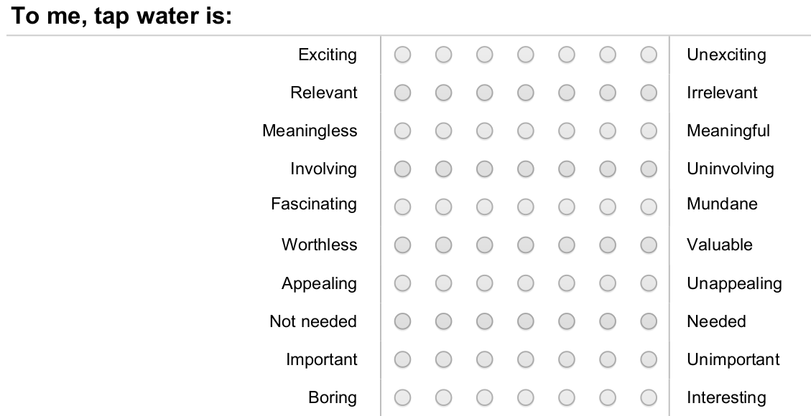

# Analysing the Customer Experience in Data

The services that water utilities provide to their communities rely heavily on investments in engineering. Most of the data that water utility professionals analyse is therefore abstract information derived from measurement instruments and laboratory testing.

Water utilities have become more aware of their role in the community and also start to analyse information they collect from their customers. Data collected from living human beings instead of from scientific instruments requires a different approach to technical data. 

Technical professionals often lament that customer data is merely subjective and that it therefore is unable to provide real insights. The following three chapters show some of the techniques that social scientists use to construct and analyse surveys to minimise bias. While each individual answer is a subjective assessment, a well-designed and appropriately analysed customer survey can provide actionable insights into how a utility can improve its services perceived by the customer.

This chapter introduces a customer satisfaction study and shows how to clean data in a reproducible manner. This chapter also introduces some theoretical concepts that are important to understand the principles of analysing subjective data.

## Case Study 2
This second case study uses data from a dissertation on [water utility marketing](http://hdl.handle.net/1959.9/561679). This research includes a survey of American  tap water consumers to measure their perception of tap water services. The survey included questions to measure consumers' involvement with tap water services and their perception of service quality. The survey also asked respondents to provide comments on certain topics. 

The data has been slightly modified to anonimise the respondents in line with the Gormsey case study. Magnus Delarosa, the Grand Wizard of the Gormsey water utility, asked the inhabitants of three cities to provide their opinion.

Magnus has two questions: How much do people care about the great service that the Invisible Water Utility provides? His second questions is how happy the people of Gormsey are with their service provider. Magnus sent messengers across the land to recruit people to complete a survey. 

Your task, should you choose to accept it, is to clean and analyse the data and answer these two burning questions that Magnus has on his mind.

## Exploring the Data
You can find the data in the `casestudy2`folder of your RStudio project. Load the data and explore its content with some of the techniques you have learned so far. This data is the raw data as collected from the online survey system.

> Load the survey data in memory and use the `glimpse()` function to review the content and structure.

```R
library(tidyverse)
rawdata  <- read_csv("casestudy2/customers.csv")
glimpse(survey)
```

We use the `rawdata` variable name because we want to keep this data intact as we process it, in case we need to use it again.


## Cleaning Data
The data from the previous studies was an example of a perfect world without missing data and other issues. Many practitioners will tell you that cleaning data can be 80% of the work. Cleaning data is extremely important because even the most advanced algorithm can't create value from rubbish. As the old adagio goes: "Rubbish-in is rubbish-out". 

This first case study revolves around cleaning the customer survey data set to a format that we can easily visualise and analyse.


## Consumer Involvement
Consumer involvement is an essential marketing metric that describes the relevance a product or service has in somebody's life. People who own a car will most likely be highly involved with purchasing and owning the car due to a large amount of money involved and the social role it plays in developing their public self. Consumers will most likely have a much lower level of involvement with the instant coffee they drink than with the clothes they wear. More formally, consumer involvement can be defined as a person's perceived relevance of the object based on inherent needs, values, and interests.

Consumer involvement is vital because it is causally related to willingness to pay and perceptions of quality. Consumers with a higher level of involvement are willing to pay more for a service and have a more favourable perception of quality.

Understanding involvement in the context of urban water supply is also important because sustainably managing water as a common pool resource requires the active involvement of all users. The level of consumer involvement depends on a complex array of factors, which are related to psychology, situational factors and the marketing mix of the service provider. The lowest level of involvement is considered a state of inertia, which occurs when people habitually purchase a product without comparing alternatives.

Cult products have the highest possible level of involvement because customers are devoted to the product or brand. Commercial organisations use this knowledge to their advantage by maximising the level of consumer involvement through branding and advertising. This strategy is used effectively by the bottled water industry. Manufacturers focus on enhancing the emotional aspects of their product rather than on enhancing the cognitive aspects. Water utilities tend to use a reversed strategy and emphasise the cognitive aspects of tap water, the pipes, plants and pumps, rather than trying to create an emotional relationship with their consumers.


The involvement part of the survey uses a semantic differential scale. This method requires respondents to choose on a scale between two antonyms (figure 5.1). This type of survey measures the meaning that people attach to a concept, such as a product or service. The items were presented in a random order to each respondent. The words on the right indicate a high level of involvement. Fiver questions have a reversed polarity, which means that the left side indicates a high level of involvement.

{width: 80%}



