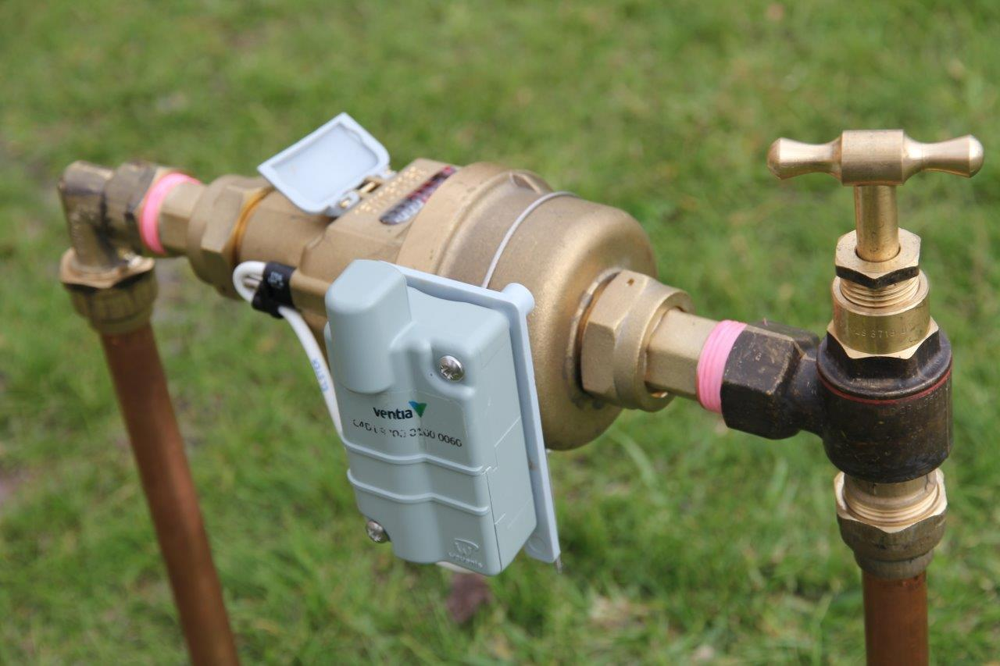
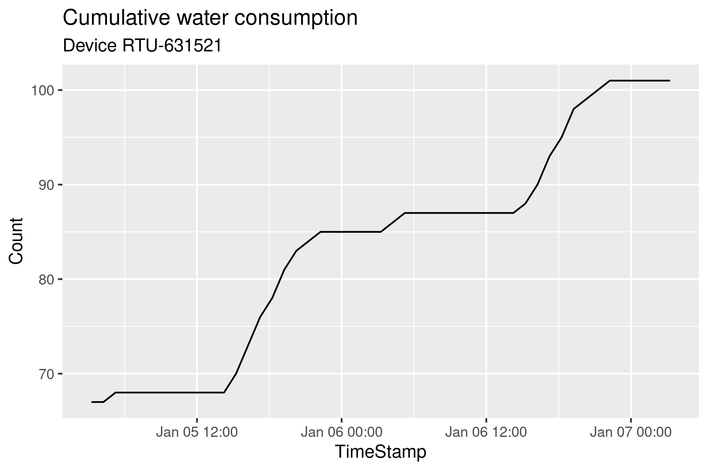
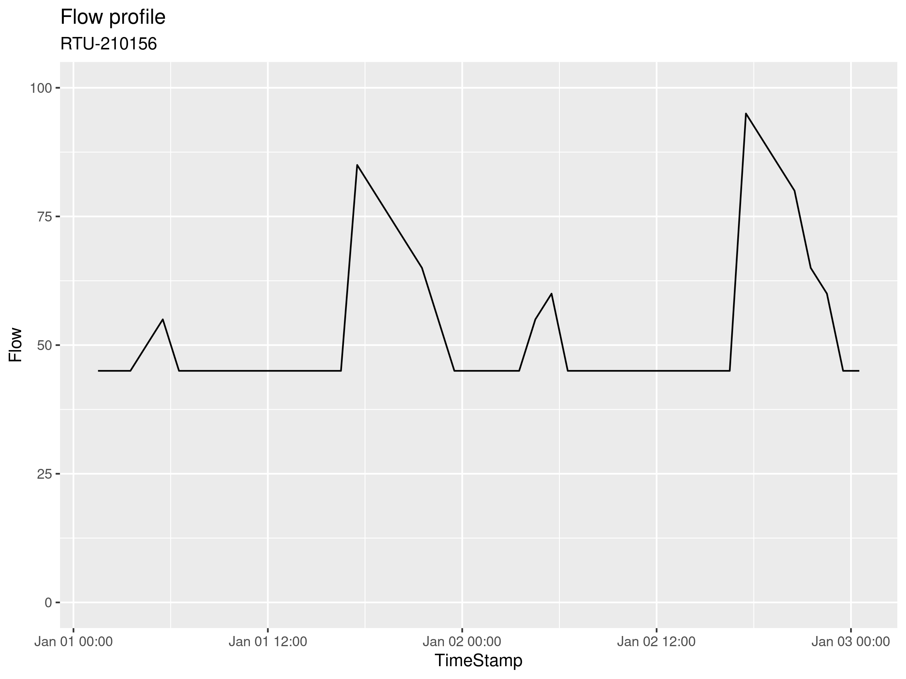
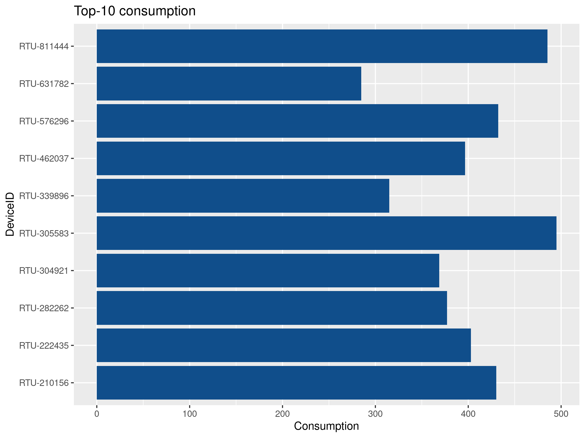

# Time Series Data {#timeseries}

The remaining chapters of this course discuss analysing time series data from digital water meters. Traditionally, water utilities only measure consumption from individual customers when a bill needs to be generated. New technology enables these water meters to transmit data at a much higher frequency so that we can gain deeper insights into how consumer use their water. This data unlocks many benefits, from providing customers with detailed knowledge of their consumption, to leak detection and network optimisation. This case study uses the functionality of the Tidyverse to analyse smart meter data.


## Problem Statement
Most water utilities measure the consumption of their customers once per month or even less, and some don't measure consumption at all. While this practice might be sufficient for billing, the limited amount of consumption data constrains the knowledge utilities can have about how water moves through the system. This approach is like looking at your bank balance once every month and then try to figure out where your money went.

The invisible water utility has just completed a pilot study of 100 services in the Gormsey system.  fitted with data loggers on existing services. One year of data is available, and your task is to explore this data and develop some algorithms to visualise consumption and to find services with leaks.

### Smart Water Meters
The term smart meters is quite common, but it contains a lot of marketing spin. Most customer water meters in this category are standard devices fitted with an electronic data logger and transmitter. These data loggers are an integral part of the meter, or they are retrofitted to the device. These meters are not intrinsically smart but provide the utility with detailed data that allows water professionals to make smarter decisions.



Smart meters provide data at varying frequencies, from every few seconds to daily reads. Deciding how much data to collect depends on several considerations.

Water engineers ideally like a reading every five minutes to match their modelling frequency, while the billing department was more than happy with one daily reading. The customer service team likes to know whether a property leaks. 

The higher the data rate, the higher the cost of collection due to increased transmission bandwidth and reduced battery life. Collecting data every few minutes is most likely unfeasible and potentially unethical because it reveals too much about the lifestyles of customers. Daily data is insufficient to provide benefits in network design and operation. Hourly reads seems a good compromise because it allows for most of the sought benefits, doesn't significantly impact the privacy of customers, and is within reasonable reach for the current level of technology.

### Simulating water consumption
The data for this case study is simulated, based on assumptions and stochastic variables. This data was created in a first step to develop a reporting system for smart meter data. Using simulated data enabled the development of the software before the actual data was available.

The data is simulated for two reasons. Firstly, detailed information about the water consumption of consumers reveals information about their lifestyle. The data reveals how many people live in the house, their nightly toilet habits, holidays, and so on. Secondly, simulating data is an effective way to test computational methods because we know the expected outcomes.

The R language includes many functions to generate patterns of random numbers to simulate stochastic processes. Simulating a process can provide information about the distribution of possible outcomes through a [Monte Carlo simulation](https://www.investopedia.com/terms/m/montecarlosimulation.asp). This type of simulation is often applied to probabilistic cost estimates.

The method used to simulate the data is explained in an R Markdown file in the `casestudy3` folder. This folder also contains a PDF version of this file, knitted with LaTeX.

## Analysing water consumption
The smart metering data does not need any cleaning because it is already tidy. There is only one observation for each device at a point in time. The first step is to load the data into a variable.

X> Load digital metering data into the `reads` variable.

{format: r, line-numbers: false}
```
reads <- read_csv("casestudy3/meter_reads.csv")
glimpse(reads)
```

Using the `glimpse(reads)` expression, we find out that the data has three variables with 876,000 observations (reads).

{line-numbers: false}
```
Observations: 876,000
Variables: 3
$ DeviceID   <chr> "RTU-2378716", "RTU-2378716", "RTU-2378716", "RTU-2378716"…
$ TimeStamp <dttm> 2069-06-30 14:09:08, 2069-06-30 15:09:08, 2069-06-30 16:0…
$ Count      <dbl> 2, 4, 5, 7, 10, 12, 17, 24, 30, 35, 39, 43, 47, 51, 54, 58…
```

The consumption data is provided as the number of cumulative counts in five-litre increments (Figure 7.2). A flat line indicates that there was no consumption, and a sloped line implies that the occupants consumed water.



D> What conclusions can you draw about the lifestyle of the hypothetical people that live at this imaginary property?

To determine the level of consumption between two reads in litres per hour, we need to subtract two consecutive reads from each other. Since there is no missing data in this case study, the period between all reads is precisely one hour. In real life, there are missing data points, which means you also need to determine the time difference between subsequent reads.

A fast way to determine the difference between consecutive numbers in a vector is the `diff()` function. An example illustrates the principle. The code below results in a vector with four times the number 1: (`2 - 1, 3 - 2, 4 - 3, 5 - 4`$). Note that this new vector is one element shorter than the original.

{format: r, line-numbers: false}
```
v <- c(1, 2, 3, 4, 5)
diff(v)
```

However, if we apply this function to the whole data frame, we get in trouble when we move from one device to the next. Taking the difference between rows 2 and 3 leads to negative consumption. You can use `summary(diff(reads$Count))` to see the negative values.

{format: r, line-numbers: false}
```
reads[(24 * 365 - 1):(24 * 365 + 2), ]

  DeviceID    TimeStamp           Count
  <chr>       <dttm>              <dbl>
1 RTU-6408930 2070-06-30 12:15:35 12410
2 RTU-6408930 2070-06-30 13:15:35 12410
3 RTU-1300375 2069-06-30 14:57:49     5
4 RTU-1300375 2069-06-30 15:57:49    10
```

We can solve this problem by applying the `diff()` function to the grouped data. However, because the result is one shorter than the original vector, we need to add an `NA` value to the result. Without this addition, we cannot fill every value in the data frame, which is a requirement. The difference between consecutive values is multiplied by five to get litres per hour. The `mutate()` function assigns the new variable to the data frame.

After we have the flow, the `Count` variable can be ditched, and we remove all `NA` values in `Flow` (the very first read). This data frame is the basis of all further analysis, so we save it to disk.

{format: r, line-numbers: false}
```
flow <- reads %>%
    group_by(DeviceID) %>%
    arrange(TimeStamp) %>%
    mutate(Flow = c(NA, diff(Count) * 5)) %>%
    select(-Count) %>%
    filter(!is.na(Flow))    

write_csv(flow, "casestudy3/flow.csv")
```

### Visualising Consumption
Now that we have the flow in litres per hour for each service it is pretty easy to visualise consumption for individual properties.

Q> Recreate the graph in figure 7.3. Tip: First use the `slice()` function to select the first 48 rows and filter the data to only show the device with serial number RTU-210156. Make sure the y-axis scales between 0 by including `ylim(0, 100)` in your call of the ggplot function.



D> What story does the graph in figure 7.3 tell?

### Top Ten Users
The previous section visualises flow for one specific service. While this is interesting, in any real-life situation, you need to review the flow of thousands or even millions of services. Also, viewing data in detail from individual services should only be done for operational reasons because this information is privacy-sensitive.

Instead then reviewing the individual performance of each service, we need to look at anomalies. The `group_by()` function summarises data for groups of services over time.

This following example shows how to find the top ten users in the available data. The code groups the flow data by device ID and summarises the consumption for each service by summing the flows and converting this to cubic meters (or kilolitres for Australians).

To find the top ten users, we first arrange the data by consumption. By default, the `arrange()` function sorts data in ascending order (low to high). Adding the `desc()` function sorts the data in descending order.

The last step uses the `top_n()` function to select the top ten users.

{format: r, line-numbers: false}
```
top10 <- flow %>%
    group_by(DeviceID) %>%
    summarise(Consumption = sum(Flow) / 1000) %>%
    arrange(desc(Consumption)) %>%
    top_n(10)
```

Q> Reverse-engineer this code to understand how it works. Use the `slice()` function to achieve the same result. Visualise the results to replicate Figure 7.4.




